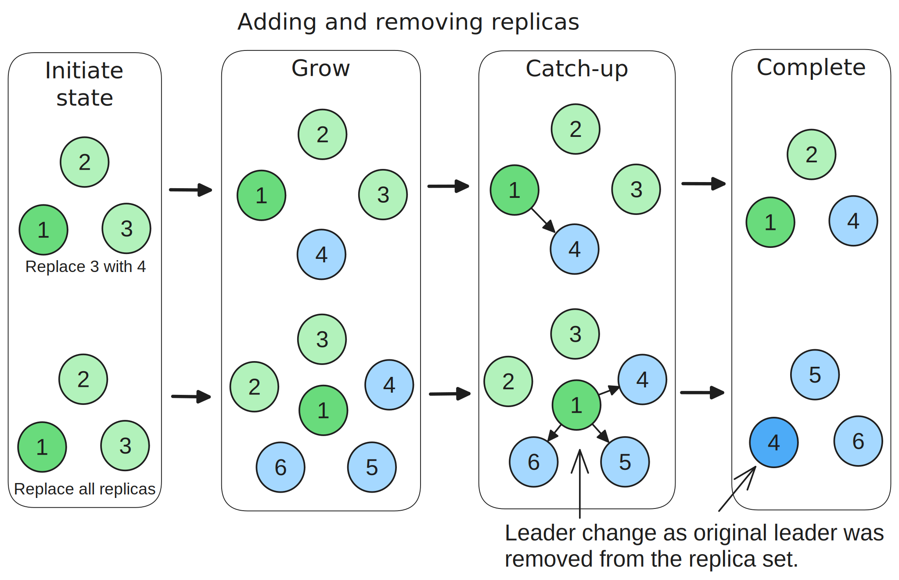
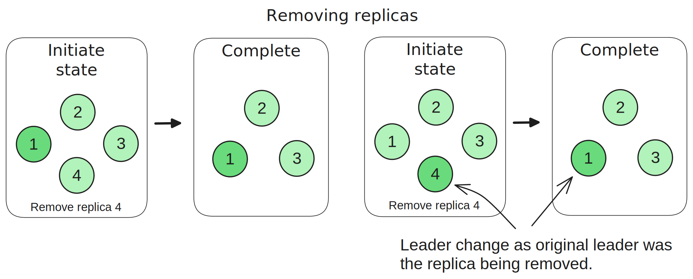
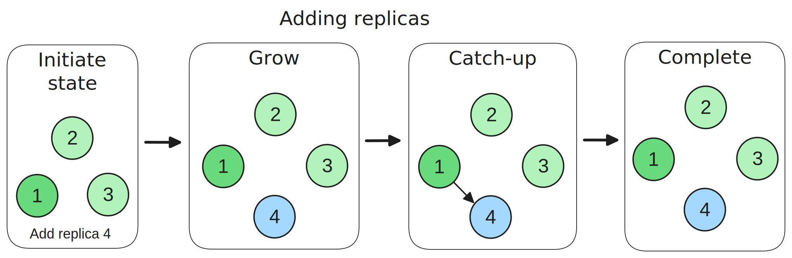

# 4. Partition reassignment (reconfiguration)

The protocol includes member reconfiguration (adding and removing of replicas) which is known as partition reassignment. A reassignment request is processed by the controller and a single request can contain reassignments for multiple partitions (across multiple topics).

The reassignment of any given partition can consist of:

- Only removing replicas, (lowering the replication factor (RF).
- Only adding replicas, increasing the replication factor.
- Both adding and removing replicas (moving/replacing replicas).

Two requests are involved in partition reassignments:

- An AlterPartitionReassignments request initiates (and potentially completes) a reassignment.
- An AlterPartition request sent by the leader replica can complete an ongoing reassignment.

## 4.1 General approach to different reassignments

### 4.1.1 Adding and removing (moves, replacements)

Reassignments that both add and remove replicas are performed in three phases:

1. Growth phase. A partition change is made to expand the replica set to be the union of the current and target assignment. The ISR is left unchanged.
2. Catch-up phase. The added replicas catch-up to the leader and get added to the ISR. This can span multiple AlterPartition requests from the leader if there are multple added replicas.
3. Complete (shrink/commit) phase. The final `adding` replica is added to the ISR by an AlterPartition request. As part of this request handling, the controller sets the replica set to the target assignment, excludes from the ISR and ELR any `removing` replicas, bumps the epochs and clears the `added` and `removed` sets and bumps the epochs.

The completion phase can only occur if the final ISR >= MinISR in order to respect the fault tolerance that MinISR is designed for. 

<figure>
    
    <figcaption>Fig 1. Partition reassignment consisting of adding and removing replicas.</figcaption>
</figure>

### 4.1.2 Only removing (decreasing RF)

Reassignments that only shrink the replica set can be committed in a single partition change (as long as the final replica set and ISR would not be smaller than the MinISR).

<figure>
    
    <figcaption>Fig 2. Partition reassignment consisting of only removing replicas.</figcaption>
</figure>

### 4.1.3 Only adding (increasing RF)

Reassignments that only expand the replica set must be done across three phases:

1. Growth phase. Set the replica set to the target replica set.
2. Catch-up phase. Wait for all added replicas to be added to the ISR.
3. Complete phase. Clear the `added` and `removed` sets and bump the epochs. 

Again, the AlterPartition requests perform the catch-up and complete phases. The completion can only occur if the final ISR is equal to or larger than the configured MinISR.

<figure>
    
    <figcaption>Fig 3. Partition reassignment consisting of only of adding replicas.</figcaption>
</figure>

## 4.2 Controller logic

A partition has an ongoing reassignment if it has a non-empty
`adding` or `removing` set in its metadata.

The controller can complete a reassignment either during the `AlterPartitionReassignments` request processing or during a later `AlterPartition` request processing. It may take just a single AlterPartition request to complete an ongoing reassignment or the reassignment may span multiple such requests. Only once the completion rules are satisfied, or a cancellation is issued does the reassignment terminate.

The controller can execute a reassignment in a single atomic partition change if no replicas are being added (just step 3 below). But when there are replicas to be added, it executes the reassignment as steps 1, 2 and 3.

1. Growth partition change:
   - Set the replica set to be the union of the current and target assignment.
   - Leave the leader, leader epoch and ISR unchanged.
   - Increment the partition epoch.
2. Catch-up partition change:
   - Add an `adding` replica to the ISR as a result of an AlterPartition request from the leader.
   - Potentially empty the ELR if ISR >= MinISR.
   - Increment the partition epoch.
3. Completion partition change:
   - Update the replica set to the target assignment.
   - Update the ISR and ELR to exclude any removed replicas.
   - Potentially empty the ELR if the updated ISR >= MinISR.
   - Change the leader if the leader is not a member of the target assignment (selecting from the new ISR).
   - Increment the leader epoch (whether the leader is changed or not).
   - Increment the partition epoch.

Note that partition changes 2 and 3 can occur in the same AlterPartition request processing.

Rules for a reassignment to be complete:

1. The final ISR if applied would be equal to or larger than the MinISR.
2. All `adding` replicas are members of the final ISR to be applied.

If the above rules are not met, then the reassignment remains ongoing and the final completion phase is not executed (the final replica set, ISR and ELR are not applied).

Because of the grow then shrink approach, a single reassignment does not need to have the current and target assignment intersect.

## 4.3 Partition replica logic

The replicas learn of the partition change via the metadata log replication.

- Newly added replicas become followers and start fetching from the leader from scratch (or receive the log as part of an AlterLogDir process).
- Removed replicas have their partition removed from its broker fetcher and it gets deleted locally.

The leader learns of the new replica set, it clears the state it maintains on any removed replicas (such as its LEO and broker epoch). When new followers catch-up, the leader sends AlterPartition requests to the controller.

## 4.4 Example reassignments

### 4.4.1 Example 1 - moving one replica

For example, due to an impaired broker 3, we want to move the replica on broker 3 to broker 4:
- current assignment: [1, 2, 3]
- target assignment: [1, 2, 4]

The controller takes the partition metadata through the following transitions:

1. Initial state:
   - Replicas=[1, 2, 3]
   - ISR=[1, 2]
   - Leader=1
   - LeaderEpoch=1
   - PartitionEpoch=2
   - Adding=[]
   - Removing=[]
2. The controller processes an AlterPartitionReassignments request to start the reassignment (grow):
   - Replicas=[1, 2, 3, 4]
   - ISR=[1, 2]
   - Leader=1
   - LeaderEpoch=1
   - PartitionEpoch=3
   - Adding=[4]
   - Removing=[3]
3. Replica 4 learns it is a follower and starts catching up to the leader.
4. The leader sends an AlterPartition request to add replica 4 to the ISR.
5. The controller receives the AlterPartition request and completes the reassignment: 
   - (catch-up - intermediate state)
     - Replicas=[1, 2, 3, 4]
     - ISR=[1, 2, 4]
     - LeaderEpoch=1
     - PartitionEpoch=3
     - Adding=[4]
     - Removing=[3]
   - (complete - final state)
     - Replicas=[1, 2, 4]
     - ISR=[1, 2, 4]
     - LeaderEpoch=2
     - PartitionEpoch=4
     - Adding=[]
     - Removing=[]

Notice that because we only have one replica being added, the AlterPartition request processing emcompassed the catch-up and completion in one atomic partition change operation. If there were multiple replicas being added and multiple AlterPartition requests were sent by the leader, then the catch-up and completion could span multiple requests.

### 4.4.1 Example 2 - reducing replication factor

The administrators wish to reduce the replication factor from 5 to 3:
- Leader: 5
- Current assignment: [1, 2, 3, 4, 5]
- Target assignment: [1, 2, 3]
- MinISR=2

The controller takes the partition metadata through the following transitions:

1. Initial state:
   - Replicas=[1, 2, 3, 4, 5]
   - ISR=[4, 5]
   - Leader=5
   - LeaderEpoch=1
   - PartitionEpoch=2
   - Adding=[]
   - Removing=[]
2. The controller processes an AlterPartitionReassignments request to start the reassignment, however, the ISR consists of the two replicas we wish to remove. The final ISR would be empty, violating the MinISR rule. The reassignment is started but cannot complete yet:
   - Replicas=[1, 2, 3, 4, 5]
   - ISR=[4,5]
   - Leader=5
   - LeaderEpoch=1
   - PartitionEpoch=3
   - Adding=[]
   - Removing=[4, 5]
3. Replica 1 catches up and the leader sends an AlterPartition request to add replica 1 to the ISR.
4. The controller receives the AlterPartition request and adds replica 1 to the ISR. However, the final ISR would consist only of replica 1, violating the MinISR rule. The reassignment remains ongoing: 
   - Replicas=[1, 2, 3, 4, 5]
   - ISR=[1, 4, 5]
   - Leader=5
   - LeaderEpoch=1
   - PartitionEpoch=4
   - Adding=[]
   - Removing=[4, 5]
5. Replica 2 catches up and the leader sends an AlterPartition request to add replica 2 to the ISR.
6. The controller receives the AlterPartition request and adds replica 2 to the ISR. The final ISR [1, 2] meets the MinISR rule and the reassignment completes: 
   - (catch-up - intermediate state)
     - Replicas=[1, 2, 3, 4, 5]
     - ISR=[1, 2, 5]
     - Leader=5
     - LeaderEpoch=1
     - PartitionEpoch=4
     - Adding=[]
     - Removing=[4, 5]
   - (complete - final state)
     - Replicas=[1, 2, 3]
     - ISR=[1, 2]
     - Leader=2
     - LeaderEpoch=2
     - PartitionEpoch=5
     - Adding=[]
     - Removing=[]

## 4.5 Canceling a reassignment

A reassignment may need to be canceled if an added replica is unable to catch-up. A cancellation request will revert the change. 

However, there exists the possibility that not enough replicas of the original replica set are members of the ISR. In this case a revert is not safely possible as the final ISR would be smaller than the MinISR. If unclean leader election is enabled for the topic then the revert is completed anyway, by electing an ISR member as leader or if the ISR is empty, performing an unclean leader election. If unclean leader election is disabled (which is the common case) then the cancellation would abort with an error.

 
 

- [Back - 3. Log Divergence](3_log_divergence.md)
- [Next - 5. Asynchronous storage and recovery](5_recovery.md)