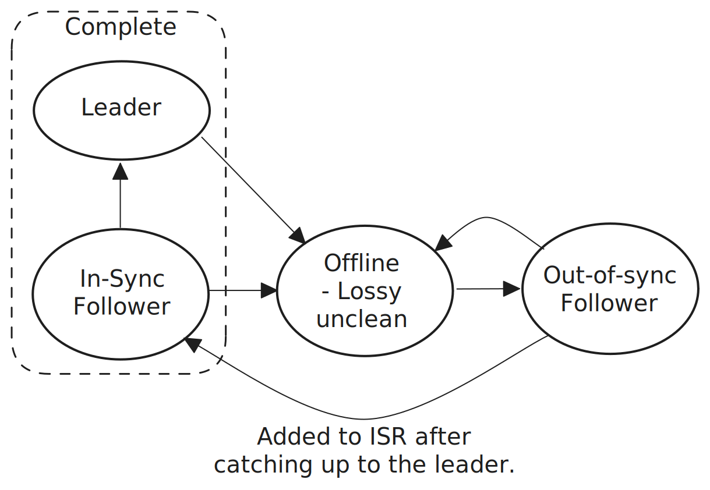
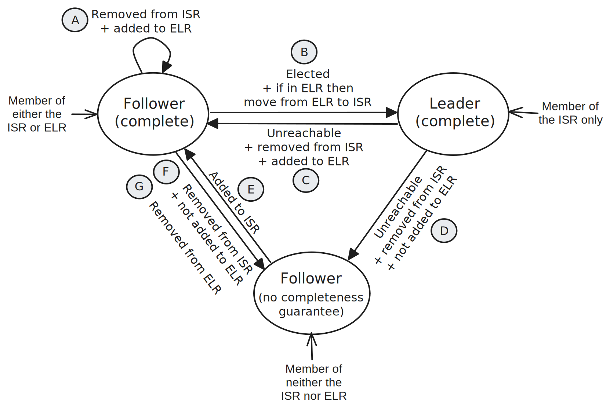
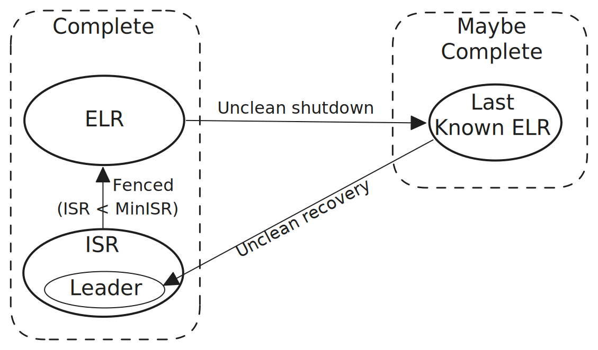

# 5. Asynchronous storage and recovery

Unlike protocols such as Raft and Paxos, the Kafka replication protocol is designed to support the asynchronous writing of log records to disk. This is attractive because disk flushes are expensive and even modern SSDs prefer large sequential writes than smaller random ones. By leveraging the page cache and the ability to perform fewer, larger writes to the underlying disk, Kafka gains a lot in sustained performance. However, the trade-off is that replicas can lose data that they previously acknowledged and without building special behavior into the protocol, local data loss can easily translate into global data loss.

Therefore Kafka employs recovery as a strategy to replace the stable storage guarantees it loses when not employing synchronous flushing. Other protocols such as [Viewstamped Replication Revisited](https://pmg.csail.mit.edu/papers/vr-revisited.pdf), Apache BookKeeper (without the journal) and the [SAUCR paper](https://www.usenix.org/system/files/osdi18-alagappan.pdf) have similar recovery mechanisms which allow them to write to disk asynchronously. However, because they are quorum based, the rules regarding leader eligibility are slightly different to Kafka.

Kafka can be configured with the following flush behavior:

- Every write (before HWM advancement and therefore writes are synchronous).
- Every nth write (allowing the HWM to advance in between flushes and therefore writes are asynchronous).
- Every n milliseconds (allowing the HWM to advance in between flushes and therefore writes are asynchronous).
- Only when a segment is rolled, split etc (asynchronous).

Note that the OS will be performing constant background flushes, keeping the dirty ratio below its configured threshold.

The rest of this section related to Kafka configured to write asynchronously to disk.

## 5.1 Recovery basics

### 5.1.1 Unclean shutdowns/abrupt terminations

Local data loss can occur when a broker experiences an unclean shutdown. We’ll define a general unclean shutdown as just case 1 below but a lossy unclean shutdown requires both case 1 and 2:

1. The shutdown is either abrupt and instantaneous or does not leave enough time for the full shutdown sequence to occur. 
2. The process page cache is also discarded.

A controlled shutdown sequence includes the flushing of all unflushed data to disk and writing its broker epoch to disk (if not present on start-up the unclean shutdown is detected). If this disk synchronization process is not performed and the page cache is also discarded then data loss can occur. The page cache would not be discarded if the Kafka process was terminated but the OS remained up. This is one advantage that Kafka has over Viewstamped Replication Revisited and Apache BookKeeper (without the journal) as both of those designs keep unflushed data in process memory, not the page cache.

### 5.1.2 General approach

Recovery is built on the strategy that unclean replicas should not be allowed to become leaders or leader candidates. Unclean replicas may have formerly been complete but now incomplete and so are treated as suspect until proven complete again through replication with the leader.

> Unclean Exclusion property: A replica that has restarted after an unclean shutdown must be excluded from leadership, the ISR and ELR until it has provably caught-up to the leader.

However, when the controller is unable to safely elect a leader for an unclean replica to recover from, a fallback strategy of physical log inspection is carried out to identify the best replica to elect as leader, from which any remaining unclean replicas can recover from.

Recovery is split into two phases:

1. Clean recovery which is possible when no more than a threshold of `f` replicas have experienced a concurrent lossy unclean shutdown (where `f = MinISR - 1`). 
2. Unclean recovery is executed when clean recovery is not possible. Balanced-mode recovery offers the same safety guarantee as clean recovery but can also complete when `f >= MinISR` with probabilistic data loss.

## 5.2 Clean recovery via the ELR

Let's consider a replica affected by the unclean shutdown of its host broker. When the broker starts (clean or unclean) it cannot complete its boot sequence until it has been fenced by the controller and have been removed from all partition leadership and all partition ISRs. This is a [fundamental condition](6_replication_correctness.md#651-broker-fencing-broker-epochs-and-unclean-brokers) for a new registration. Under normal conditions, after the broker has registered, the replica is now an out-of-sync follower until it catches up with the leader and gets re-added to the ISR. All lost data is recovered and the partition returns to its normal level of redundancy.

However, there exist cases where the ISR shrinks to empty and in these cases there would be no leader to recover from. This is where the controller relies on the ELR to elect a leader which unclean replicas can then recover from. The MinISR is the minimum replication factor of committed records (bar broker failures). As long as no more than `MinISR - 1` brokers experience data loss there exists a copy of the committed data to recover from. The ISR can shrink to empty so to ensure MinISR durability, once the ISR reaches MinISR, any further ISR removals become moves to the ELR resulting in a combined ISR + ELR size of at least MinISR. The insight here is that when the ISR < MinISR, the HWM cannot advance so we can effectively freeze the leader candidate pool at this point.

During the controlled shutdown, after having flushed all unflushed partition data to disk, a broker writes its broker epoch to file. If the broker experiences an unclean shutdown, then this file is not written to disk. On start-up the broker registers with the controller using the broker epoch on file if it exists, else it uses an empty value. When the controller receives an empty broker epoch value in the broker registration request, the controller removes all replicas of that broker from their ELRs (if currently a member). These replicas would already have been removed from their respective ISRs when fenced but they could have remained members of their ELRs and therefore be leader candidates. By removing unclean replicas from ELRs we ensure no unclean replica can be a leader candidate.

Once registered and in the RUNNING status, all a broker's partition replicas are out-of-sync followers and can only be readded to their respective ISRs when they have become in-sync. This gives us the Unclean Exclusion property.

<figure>
    
    <figcaption>Fig 1. When a leader or in-sync follower experiences a lossy unclean shutdown, it must first pass through the out-of-sync phase where it is not a leader candidate. Only once it has proven itself to host the complete committed log can it become a leader candidate.</figcaption>
</figure>
 

Out-of-sync followers are those that have become unreachable, fallen behind or become untrustworthy due to an unclean shutdown. The only way of becoming trusted again is to prove trustworthy by catching up to the leader.

## 5.2.1 ISR, ELR and replica completeness

The following figure describes how any given replica transitions between having and not having a completeness guarantee.

<figure>
    
    <figcaption>Fig 2. The ISR, ELR and unclean replicas.</figcaption>
</figure>
 

While a replica itself doesn't get fenced (the broker does), for brevity replicas are referred to as getting fenced in the following transition descriptions. These transitions focus on a single replica and its completeness guarantees:

- Case A. The controller fences replica R which is currently an in-sync follower and removes it from the ISR. Before committing this metadata change, the controller sees that the ISR is now < Min ISR therefore the controller adds replica R to the ELR. It is safe because the leader cannot advance the high watermark and so replica R will remain complete.
- Case B. The controller elects replica R, which is an unfenced follower and member of the ISR or ELR. The controller transfers the replica from the ELR to the ISR if it is currently an ELR member.
- Case C. The controller fences replica R, which the current leader. Another leader candidate is elected and replica R is removed from the ISR. Before committing this metadata change, the controller sees that the ISR is now < Min ISR therefore the controller adds the replica to the ELR. It is safe because the leader cannot advance the high watermark and replica R will remain complete.
- Case D. The controller fences replica R which is the current leader. Another leader candidate is elected and this replica is removed from the ISR. The new ISR >= Min ISR which means the new leader can advance the high watermark. Therefore replica R has no completeness guarantee and is not added to the ELR.
- Case E. Replica R, which is currently an out-of-sync follower, has caught up to the leader and the leader adds the out-of-sync follower to the ISR.
- Case F. Replica R, which is a currently an in-sync follower, goes out-of-sync and is removed from the ISR. The new ISR >= Min ISR therefore replica R loses its completeness guarantee and is not added to the ELR.
- Case G. Replica R is a fenced follower and a member of the ELR. The ISR just got expanded to be >= Min ISR and the high watermark can now advance again. Therefore replica R lose its completeness guarantee and must be removed from the ELR.

## 5.2.2 Clean ELR-based recovery example

The following is an example of how Kafka's clean recovery mechanism ensures data safety despite the lossy unclean shutdown of the leader and sole ISR member.

1. Initial state: `Leader=1, ISR=[1,2,3], ELR=[]`
2. Due to a degraded environment the ISR shrinks down to the leader (network connectivity has become flaky or some portion of the brokers have a temporary storage degradation for example). 
   - First replica 2 is removed from the ISR. The ISR is still large enough for the HWM to advance therefore replica 2 is not added to the ELR: `Leader=1, ISR=[1,3], ELR=[]`
   - Then replica 3 is removed from the ISR. The ISR is now smaller than the MinISR and so replica 3 is added to the ELR. `Leader=1, ISR=[1], ELR=[3]`.
3. Replica 1, the leader and sole member of the ISR experiences an unclean shutdown. The controller fences replica 1 and elects replica 3 as the new leader. `Leader=3, ISR=[3], ELR=[]`.
4. Replica 1 reregisters, catches up to the leader and gets readded to the ISR. `Leader=3, ISR=[1,3], ELR=[]`.

No data loss (of acks=all requests) records could have occurred because as soon as the ISR shrank only to the leader the HWM could not have advanced and so replica 3 was guaranteed to be complete when it was later elected as leader.

## 5.3 Unclean recovery

If MinISR unclean shutdowns occur then the ISR and ELR of a partition can end up empty. When both the ISR and ELR are empty the controller does not know if any complete replicas exist or not and so cannot perform a clean election. However, unclean shutdowns do not always cause local data loss and so there may be complete replicas that could be eligible for leadership which the remaining replicas can recover from. Finding these replicas is the job of unclean recovery.

Unclean recovery has three strategies of different durability levels which are configured via `unclean.recovery.strategy`:

- `proactive` (optimized for availability).
- `balanced` (optimized for safety but automated)
- `manual` (optimized for users who have their own recourse that they wish to employ).

### 5.3.1 Modes

*Proactive* recovery triggers when a clean leader election is still possible but none of the candidates are available in that very moment. There may be ELR members but they are currently fenced. Instead of waiting for an ELR member to become unfenced, it immediately initiates the log inspection recovery. Once triggered, the proactive recovery process simply does a best-effort attempt to contact all replicas but picks the best log of any replies it gets within a short time period. This is for users who want availability above all.

*Balanced* recovery triggers only when the ISR and ELR have become empty and therefore a clean election is never going to be possible. It involves the controller inspecting the logs of the *LastKnownELR* and choosing the one with the highest epoch and offset. The LastKnownELR is a set stored in the partition metadata that contains previous ELR members that may still be complete. When an ELR member has an unclean shutdown, it is removed from ELR and added to the LastKnownELR. The LastKnownELR is cleaned when the ISR reaches the MinISR and the HWM can advance.

<figure>
    
    <figcaption>Fig 3. How replicas can move between the ISR, ELR and LastKnownELR.</figcaption>
</figure>
 

### 5.3.2 Balanced-mode guarantees

The LastKnownELR constitutes the recovery quorum and is guaranteed to be MinISR in size when the ISR and ELR is empty. 

> MinISR Recovery Quorum: The size of the unclean recovery quorum is guaranteed to be MinISR.

All LastKnownELR members are guaranteed to either be complete (because the unclean shutdown did not result in any data loss), or incomplete (because data loss did in fact occur). If there exists one LastKnownELR member that is complete then it is guaranteed to be selected as leader and moved to the ISR.

Therefore balanced unclean recovery has the same failure tolerance as the ELR-based clean elections: `f = MinISR - 1` where `f` is the number of lossy unclean shutdowns that should be tolerated without data loss.

The downside of unclean recovery is that the controller is unable to tell the difference between a data loss free unclean recovery and one where data loss did result. Therefore the controller must report all unclean recoveries as potential data loss events.

### 5.3.3 Balanced recovery example

The example uses the following configuration:

- `replication.factor=3`
- `min.insync.replica=2`
- `unclean.recovery.strategy=balanced`

1. Initial state:
   - `Leader=1, ISR=[1, 2, 3], ELR=[], LastKnownELR=[]`
   - `Replica 1: LEO=15, HWM=10`
   - `Replica 2: LEO=12, HWM=8`
   - `Replica 3: LEO=10, HWM=8`
2. A power outage takes down the cluster (causing an unclean shutdown on all brokers) and the cluster comes back online. The controller is a single-threaded state-machine and starts fencing the brokers one-by-one.
3. The controller fences broker 1 first and elects replica 2 as leader.
   - `Leader=2, ISR=[2, 3], ELR=[], LastKnownELR=[]`
4. The controller fences broker 2 and elects replica 3 as leader.
   - `Leader=3, ISR=[3], ELR=[2], LastKnownELR=[]`
5. The controller fences broker 3 and sets NoLeader.
   - `Leader=NoLeader, ISR=[], ELR=[2, 3], LastKnownELR=[]`
6. Broker 1 starts-up with loss of committed data and registers with the controller with an empty broker epoch value. It was not a member of the ELR so no partition metadata change is necessary.
   - `Leader=NoLeader, ISR=[], ELR=[2, 3], LastKnownELR=[]`
7. Broker 2 starts-up with *no* loss of committed data, registers with the controller with an empty broker epoch value and is moved from the ELR to the LastKnownELR.
   - `Leader=NoLeader, ISR=[], ELR=[3], LastKnownELR=[2]`
8. Broker 3 starts-up with loss of committed data, registers with the controller with an empty broker epoch value and is moved from the ELR to the LastKnownELR.
   - `Leader=NoLeader, ISR=[], ELR=[], LastKnownELR=[2, 3]`
9. The controller cannot perform clean election and triggers unclean recovery. It sends a GetReplicaLogInfo request to each replica in the LastKnownELR.
10. Once it has received a response from all the LastKnownELR replicas, it chooses replica 2 (of broker 2) as it had the log with the highest epoch and offset. In the end, no committed data was lost.

## 5.4 Deploying across failure-domains

Deploying distributed data systems across failure-domains enables the system to be reliable and available even under correlated failures such as a data center fire, a power surge that can damage hardware, a power outage or some other incident that affects multiples servers at a time. Random failures such as disk drive failures are common but do not commonly affect multiple servers of the same cluster at the same time.

Kafka replication over multiple brokers enables a Kafka cluster to tolerate random failures and replication over brokers spread across multiple failure domains enables a cluster to tolerate correlated failures that might otherwise cause an unclean shutdown on multiple brokers. This is a standard deployment model for distributed data systems and it the recommended approach for Kafka. In the cloud this means deploying brokers across multiple availability zones.

 
 

- [Back - 4. Partition reassignment](4_reassignment.md)
- [Next - 6. Replication correctness](6_replication_correctness.md)