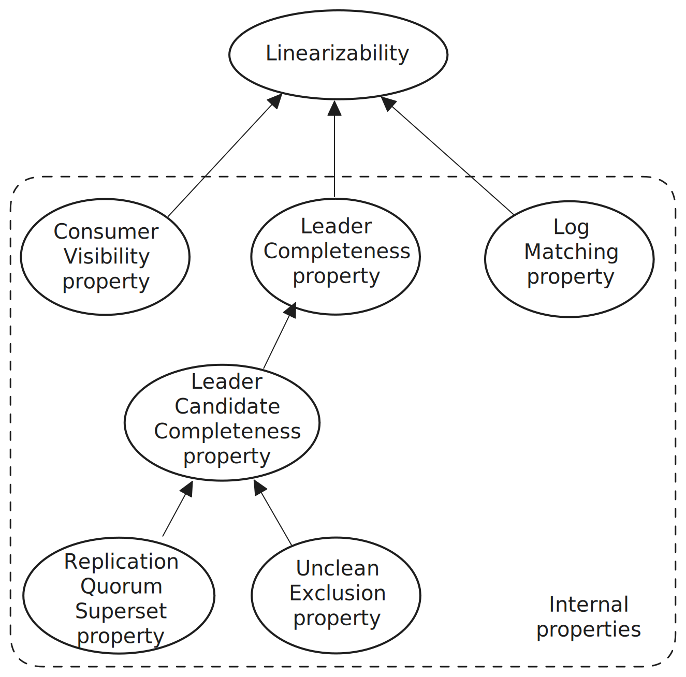

# 6. Replication correctness

So far we’ve covered how the replicas communicate with each other and the controller but this is not enough to fully understand how the design guarantees consistency. Now we’ll look at how the various epochs and behaviors support the internal properties which in turn support linearizability externally.

<figure>
    
    <figcaption>Fig 1. The relationships with the various internal properties to the linearizable semantics available to clients.</figcaption>
</figure>
 

The two most important internal properties that are needed for consistency of the log itself are the Leader Completeness property and Log Matching property. If either of these two properties are violated the log itself is inconsistent. In turn we’ll look at how the other more narrowly focused properties support Leader Completeness.

## 6.1 Linearizability Consistency

Kafka offers linearizable semantics to clients. To avoid duplication from the loss of producer acknowledgments, the wire protocol includes an idempotency mechanism based on counters, which matches the idempotency mechanisms of Raft (chapter 8) and Viewstamped Replication Revisited.

The definition of linearizability by jepsen.io is easily translatable to a log.
> Linearizability is one of the strongest single-object consistency models, and implies that every operation appears to take place atomically, in some order, consistent with the real-time ordering of those operations: e.g., if operation A completes before operation B begins, then B should logically take effect after A.
> https://jepsen.io/consistency/models/linearizable

Linearizability in Kafka is scoped to the partition (not individual records). For example, two non-overlapping writes to the same partition will result in `w1` being assigned a lower offset than `w2`, respecting the happens-before relationship of w1-before-w2. Likewise consumers will consume w1 and then w2 because w1 is earlier in the log than w2 and the log has a total order which is the same for all parties.

It is linearizable consistency rather than sequential because the advancement of the HWM triggers both positive producer acknowledgement and consumer visibility of records - and therefore qualifies for the recency condition of linearizability.

## 6.2 Baking-in unstable storage

The protocol needs to handle a limited number of lossy unclean shutdowns. Specifically, it should be able to avoid data loss with up to `Min ISR - 1` lossy unclean shutdowns.

A replica can get fenced and come back with a new broker epoch and only a prefix of its original log. The term unclean replica is used to denote a replica that has lost data after an unclean shutdown and has not yet recovered the data it had lost. Once a replica has recovered any lost data, it can be considered clean again.

The protocol should prevent unclean replicas from being elected as leader and prevent unclean replicas from joining the ISR. Subsequent sections will include discussion of unclean replicas where relevant.

## 6.3 Correctness of concurrent metadata changes

The partition metadata can be modified by the controller, the partition leader, a zombie controller or a zombie partition leader, all which can be attempting to change the metadata concurrently.

To prevent concurrent changes from causing damage there are a number of mechanisms at play:

1. The active-controller is the source-of-truth.
2. A controller must commit a change (via Raft) before it makes the change. Therefore a zombie controller cannot make changes.
3. The controller is single-threaded, processing one change at a time which means there is no possibility of race-conditions within the controller. This also means any active-controller initiated changes such as leader elections, ISR shrinks and reassignments are based on the current state.
4. The partition epoch of an AlterPartition request from a leader must match the current Partition Epoch in the metadata. This proves that the leader made its proposed change starting at a consistent view of the partition metadata - and therefore has no possible conflict. Note that an AlterPartition request can still contain stale broker-level data, this is discussed in section 6.5.

## 6.4 HWM monotonicity

The HWM stored on any given replica is the HWM that the replica knows of, not always what the “true” HWM is. The knowledge a replica has about the HWM may be arbitrarily stale and for short durations there may be no replica at all that knows the True HWM (even the leader). 

The True HWM is monotonic and is the marker that truly separates committed from uncommitted records. However, the True HWM is not explicitly recorded anywhere (though a consumer offset can line-up with it). 

The Local HWM on any given replica can be stale so treating the Local HWM as if it were the True HWM results in a non-monotonic value. The Local HWM itself is also not monotonic. The Local HWM on a follower is not monotonic because followers will overwrite their Local HWM with the HWM in a fetch response, even if the fetch response includes a lower HWM. This is possible because a leader election may choose a replica in the ISR that does not have the highest Local HWM (but does host the complete committed log).

However, the protocol itself requires HWM monotonicity for correctness and external systems (such as a stream processor like Flink) also want to be able to query the HWM and get monotonic results. The solution to this problem is discussed in the subsequent subsections.

### 6.4.1 Example of a lagging Local HWM

Here’s an example of how a leader can end-up with a stale HWM:

1. Partition state: `Replicas=[r1, r2, r3], ISR=[r1, r2, r3], Leader=0`.
    - Replica 1 (leader): `LEO=0, HWM=0`
    - Replica 2: `LEO=0, HWM=0`
    - Replica 3: `LEO=0, HWM=0`
2. Leader receives a write with one record: Replica 0: `LEO=1, HWM=0`.
3. Replicas r2 and r3 send replica r1 a fetch request with `fetchOffset=0` and the leader responds with the one record it has.
    - Replica 1 (leader): `LEO=1, HWM=0`
    - Replica 2: `LEO=1, HWM=0`
    - Replica 3: `LEO=1, HWM=0`
4. Replicas 2 and 3 send replica 1 a fetch request with `fetchOffset=1` and so the leader now knows all replicas in the ISR have offset 0 and advances the HWM to 1 (remember it is exclusive). The true HWM is now also 1.
    - Replica 1 (leader): `LEO=1, HWM=1`
    - Replica 2: `LEO=1, HWM=0`
    - Replica 3: `LEO=1, HWM=0`
5. A consumer of group CG1 consumes offset 0 and commits its consumer offset to 1.
6. The controller fences replica 1 for some reason and elects replica 2. Replica 2 is the leader but has a HWM of 0 which is less than the True HWM of 1. Partition state: `Replicas=[r1, r2, r3], ISR=[r2,r3], Leader=1`.
    - Replica 1: `LEO=1, HWM=1`
    - Replica 2 (leader): `LEO=1, HWM=0`
    - Replica 3: `LEO=1, HWM=0`

At this point, the leader has a stale Local HWM.

### 6.4.2 “Applied HWM” monotonicity

While a leader may not always know the True HWM, a leader can determine it eventually. When a leader is elected, it may have a stale Local HWM though it cannot tell if its Local HWM is behind the True HWM or not. However, when it gets elected it sets its Leader Epoch Start Offset (LESO) to match its LEO. Once its Local HWM reaches the LESO it knows that the Local HWM cannot be stale as it has been able to get all in-sync followers up to the current leader epoch. The Local HWM can only be higher than the LESO (and still within the bounds of the current leader epoch) because the leader itself advanced the HWM.

Therefore, all actions which require HWM monotonicity must only be performed once the leader has been able to advance its Local HWM to the LESO. 

> Applied HWM monotonicity: All actions which are applied based on the Local HWM and which require a monotonic HWM value must wait until the leader has been able to verify it has reached the True HWM.

Example of actions that require Applied HWM monotonicity:

- Adding an out-of-sync follower to the ISR (more details in [ISR expansion and Applied HWM Monotonicity](#653-isr-expansion-and-applied-hwm-monotonicity)).
- Responding to a ListOffsets request (which includes the current HWM in the response). If the leader does not yet know it has reached the True HWM it returns an “I don’t know” value for the HWM.

## 6.5 Correctness of leader elections

> Leader Candidate Completeness property: Every member of the ISR and ELR must host the complete committed log.

The ISR known to the leader acts as the quorum for replication (a record must be replicated to all members before acknowledgement). The ISR known to the controller plus the ELR forms the election quorum (or leader candidate pool). If the controller elects a leader from outside of the replication quorum then the new leader may not host the complete committed log and violate the Leader Completeness property which then leads to the global loss of committed data.

This issue is avoided by ensuring that all election quorum replicas are also members of the replication quorum (Leader Candidate Completeness). The following subsubsections discuss the details of how Leader Candidate Completeness holds, even under conditions such as lossy unclean shutdowns.

### 6.5.1 Broker fencing, broker epochs and unclean brokers

A broker epoch value denotes a single uptime session of a single broker. When a broker starts, it registers with the controller and receives a cluster-wide monotonic broker epoch integer. After having registered, it then starts to send periodic heartbeats to the controller. However, until the broker has been fenced by the controller, the controller will not accept a new registration attempt. For any given broker id, the previous broker epoch must be expired via fencing before a new epoch can be granted. Therefore the valid lifetime of a broker epoch is from *broker registration* to *fencing + new registration*. Fencing alone does not terminate the validity of a broker epoch. A broker can get fenced due to a network partition and as soon as a heartbeat gets through to the controller, the broker gets unfenced with the same broker epoch.

<figure>
    
    <figcaption>Fig 2. The previous broker epoch becomes invalid upon the assignment of a new broker epoch. This new broker epoch assignment can only occur once the broker (with its prior broker epoch) has been fenced. This prevents the ABA problem of quick broker reboots that afflicted the ZooKeeper based controller.</figcaption>
</figure>
 

Why does a broker epoch denote a single uptime period rather than a single unfenced period? The reason is that the protocol needs to know about broker restarts in order to support the asynchronous storage engine. Only after a restart can a partition be online without data that it had previously confirmed (to either a client or a partition leader). Broker epochs are one important mechanism that the protocol uses to prevent lossy unclean shutdowns from turning local data loss into global data loss.

> Unclean Exclusion property: A replica that has restarted after an unclean shutdown must be excluded from leadership, the ISR and ELR until it has provably caught-up to the leader.

Let’s consider some different cases where fencing and broker epochs are used for correctness when lossy unclean shutdowns occur:

- Case 1: The controller elects a replica as leader, but then the parent broker restarts uncleanly and the partition loses data. On the controller the broker is fenced, which removes the replica from leadership and the ISR. During start-up, the broker registers with an empty broker epoch value (marking it as unclean) and the controler removes it from the ELR if it is a member. The replica is now an out-of-sync follower which becomes clean again by fetching from the new leader. It can only be readded to the ISR once it has caught up and is guaranteed to be complete (Unclean Exclusion property).
- Case 2: The leader successfully adds a replica to the ISR, but then the replica parent broker restarts uncleanly and the partition loses data. The rest is the same as Case 1.
- Case 3: The broker of an *out-of-sync* follower sends a fetch request but then restarts uncleanly and the partition loses data. The broker gets fenced but no change to the partition ISR is required (as the replica is not a member) so the partition epoch remains unchanged on the controller. Concurrently, the leader receives the fetch request from the now unclean replica and determines that the replica is now in-sync. The leader sends an AlterPartition request to the controller to add the replica (even though due to data loss its log is now lower than the HWM). Because this is an ISR expansion, the leader includes the broker epoch of the added follower. The controller rejects the AlterPartition request because the broker epoch of the added replica is lower than the new broker epoch. The now stale broker epoch is invalid because it was based on a state-of-the-world which may no longer be true. The broker epoch prevented an ISR change that would have violated the Unclean Exclusion property.

Cases 1 and 2 demonstrate how fencing protects the Unclean Exclusion property and Case 3 demonstrates how the broker epoch protects it. Without Unclean Exclusion, the Leader Candidate Completeness property would be violated.

### 6.5.2 The Maximal ISR

> Replication Quorum Superset property: The replication quorum used to advance the HWM is a superset of the election quorum.

Leader Candidate Completeness only holds if the replication quorum is a superset of the election quorum. The replication quorum is the ISR known to the leader and the election quorum is the ISR known to the controller plus the ELR. Both the controller and the leader replica share responsibility for ISR changes and both can have a stale view of it at any one time. 

If the leader advanced its HWM based on a subset of the controller's election quorum then a leader election could cause data loss. For example, the controller believes the ISR to be `[r1, r2, r3]` but the leader (r1) believes the ISR to be `[r1, r2]`. The leader advances the HWM based on only `[r1, r2]` meaning that r3 could be lagging behind. The controller, believing that the ISR is `[r1, r2, r3]` could choose r3 as the new leader, despite it not hosting the complete committed log. As a result of r3 being elected, r1 and r2 would truncate their logs to match the new leader - losing committed, acknowledged records.

The Maximal ISR is used to ensure the Replication Quorum Superset property holds. When the leader replica sends an AlterPartition request to change the ISR, it sets its Maximal ISR to be the union of the Current ISR + Proposed ISR. The leader bases its HWM advancement on the fetch offset of its followers who are members of the Maximal ISR rather than the ISR.

For example:
- Expanding the ISR. The leader adds r3 to the ISR but the controller has not yet received the request and also could reject it.
    - Leader:
        - Current ISR = `[r1, r2]`
        - Proposed ISR = `[r1, r2, r3]`
        - Maximal ISR = `[r1, r2, r3]`
    - Controller: ISR = `[r1, r2]`
- Shrinking the ISR. The leader removes r3 from the ISR.
    - Leader:
        - Current ISR = `[r1, r2, r3]`
        - Proposed ISR = `[r1, r2]`
        - Maximal ISR = `[r1, r2, r3]`
    - Controller: ISR = `[r1, r2, r3]`

However, the Maximal ISR is not guaranteed to be a superset when the ISR is smaller than MinISR. The reason is that once the ISR < MinISR, the controller adds replicas to the ELR and the leader has no visibility of that.

For example:

1. All parties see `ISR=[1,2]` and the controller ELR is empty.
2. The controller fences broker 2.
   - Controller: `ISR=[1], ELR=[2]`
   - Leader: `ISR=[1], MaximalISR=[1]`
3. The leader sends an AlterPartition request to add replica 3 to the ISR. The request is inflight.
   - Controller: `ISR=[1], ELR=[2]`
   - Leader: `ISR=[1], MaximalISR=[1,3]`

At this point the replication quorum is not a superset of the election quorum. However, one of the necessary conditions for advancing the HWM is that the ISR (not Maximal ISR) known to the leader must also be equal to or larger than MinISR. Therefore while the Maximal ISR is not always a superset, it is guaranteed to be so when the HWM meets the conditions for advancement. 

The relevant conditions for HWM advancement to respect the superset property are:

1. Fetch offset values of all followers in the Maximal ISR exceed the current HWM.
2. The size of the ISR is equal to or larger than MinISR.

If the controller accepts the AlterPartition request it will update the ISR, increment the partition epoch and send a success response with the new partition metadata. On receiving the success response, the leader commits the ISR change (also setting the Maximal ISR to the new ISR).

If the controller rejects the AlterPartition request, the leader rolls back the change to the last committed metadata version.

Let’s look at what could happen **without** the eager application of the Maximal ISR:

1. The Leader is r1 and has the ISR of `[r1, r2]`. It has an empty log and the HWM is 0.
2. The leader receives a fetch request from r2 and r3 at offset 0 and responds with no records.
3. The leader sends an AlterPartition request with ISR `[r1, r2, r3]` to add r3 to the ISR. The leader does not apply the change yet, it instead waits for confirmation from the controller.
4. The leader receives some produce requests, writing offsets 0-9 to its log.
5. The leader receives a fetch request from r2 at fetch offset 0 and returns offsets 0-9 in the response.
6. The leader receives a fetch request from r2 at fetch offset 10 and advances the HWM to 10 (based on its current ISR of `[r1, r2]`).
7. The controller receives the AlterPartition request and sets the new ISR to `[r1, r2, r3]`. At this point r1 and r2 have offsets 0-9 and r3 has an empty log.
8. The controller performs a leader election and chooses r3 which does not have committed offsets 0-9.

During the period where the controller has applied the change but the leader has not received the response, the leader ISR is a subset of the controller election quorum and is now vulnerable to a leader change causing data loss - thus the need for the Maximal ISR.

### 6.5.3 ISR expansion and Applied HWM Monotonicity

In order for the leader to add a follower to the ISR, the follower must have reached the True HWM, else it would violate the Leader Candidate Completeness property. However, the leader only knows what the True HWM is once all in-sync followers have reached the Leader Epoch Start Offset (LESO). So we must apply ISR expansion to cases where either the leader’s Local HWM >= True HWM or the fetch offset of the out-of-sync follower cannot be lower than the True HWM.

Therefore the leader adds another condition when determining if an out-of-sync follower is now in-sync (in addition to the latency rules): 

1. The follower must have reached the Local HWM.
2. The follower must have reached the Leader Epoch Start Offset (LESO).

This works as follows:

- The Local HWM can only be stale when Local HWM < LESO.
- The Local HWM is guaranteed to be non-stale when Local HWM >= LESO.
- Therefore, the fetchOffset can only be equal to or higher than the Local HWM but also be less than the True HWM when it is also lower than the LESO. So condition 2 works to prevent that possibility.

### 6.5.4 ISR expansion and reassignments

The two conditions for adding a follower to the ISR that were discussed in the previous subsubsection are still not enough for correctness - only to ensure that the follower has reached the True HWM.

We must add a third condition that the leader must have received a fetch request in the current leader epoch from the follower in question. It is possible for a follower to have reached the LESO but not have sent a fetch request in the current leader epoch. For example, if we have consecutive leader changes but no new records are ever written to the log, the leader epoch advances but the LESO of each subsequent leader epoch remains the same. 

The following illustrates the need for this third condition:

Reassignments can cause a replica to be removed then readded to a partition. Normally, the leader would learn of these changes in separate metadata fetches and so it would clear the follower state in the first update and then add follower state in the second. This follower state includes the LEO and broker epoch of the follower.

However, if this removal and addition happens quickly then the leader can end-up receiving both metadata updates in the same metadata fetch response. The partition does not react to each update separately, but to the final state of the partition after both updates have been applied to the current metadata. In this case the old state and new state both included the replica that was removed then added again, the only difference is that this replica may have previously been in the ISR and now is not. When the replica was removed, it's on disk state was deleted, then it got readded as an empty replica. At this point, the new metadata only tells the leader that the replica got removed from the ISR, nothing more. Using only the first two conditions to assess if a follower is in-sync would result in this follower being added to the ISR again as its follower state indicates that its LEO has reached the HWM and LESO. Adding it now would violate the Leader Candidate Completeness property.

Therefore, we apply all of the following conditions for an out-of-sync follower to be classified as in-sync:

1. The follower must have reached the Local HWM.
2. The follower must have reached the Leader Epoch Start Offset (LESO).
3. The leader must have received a fetch request from the follower in the current leader epoch.

On top of that, for the HWM to advance we apply the conditions:

1. Fetch offset values of all followers in the MaximalISR exceed the current HWM.
2. The size of the ISR is equal to or larger than MinISR.

All these conditions ensure that Leader Candidate Completeness holds and therefore leader elections do not violate Leader Completeness (causing data loss).

## 6.6 Log matching

> Log Matching property: For all leader-follower pairs, the log prefix on both replicas is identical where the prefix is bounded by the min(Leader Local HWM, Follower Local HWM).

All writes go to the leader and are replicated to followers. This means that the order of log records is determined by the leader and all followers must match this same order. Once an offset is committed, it is stable which means it will survive leader changes. Any records at offsets equal to or greater than the HWM are unstable and may not survive leader changes. The Leader Candidate Completeness property dictates that all electable replicas host the complete committed log, however, each may have a different number of uncommitted offsets. After an election, a follower in the new leader epoch may have uncommitted records from a prior leader epoch which do not match the log of the leader. This was discussed at length in the [Log Divergence](3_log_divergence.md) section.

Divergence is detected by the leader via the first fetch request from a follower in the new leader epoch. The leader indicates the highest valid epoch and offset that it knows of that could match the follower’s log. The follower then finds the highest epoch and offset that is lower or equal to the returned diverging epoch and offset then truncates its log to that point. After truncation, the *entire follower log* is guaranteed to match the prefix of the leader log. All it must do now is resume replication at this consistent position. Thus the Log Matching property holds.

## 6.7 Correctness of reassignments (reconfigurations)

Reassignments are comparatively simple in Kafka compared to the algorithms in Raft because the membership is managed by controller. The controller itself is a single-threaded state machine on a Raft log and the metadata it hosts is the single-source of truth. Therefore reasoning about reassignments and inspecting reassignment progress is relatively simple.

The controller ensures that replica set changes do not cause data loss by the following rules:

1. The reassignment itself cannot leave the ISR smaller than MinISR.
2. The reassignment itself cannot add replicas to the ISR (which would violate Leader Candidate Completeness).
3. Durability is enhanced by performing reassignments in phases: grow, catch-up new replicas then shrink. This ensures redundancy levels are not reduced by reassignment itself, in fact reassignment increases redundancy, while new replicas catch-up to the leader. The leader itself notifies the controller, via AlterPartition requests to expand the ISR, when all new replicas contain the complete committed log. Only then can the shrink be performed which removes the old replicas from the replica set, the ISR and potentially the current leader from leadership.

## 6.8 Correctness of unclean recovery

Majority quorums are not effective when one or more nodes can go back on what they previously said. Majority quorums guarantee an overlap of one node but when a single node may have lost data it previously acknowledged the guaranteed overlap is lost.

Kafka avoids this problem by not requiring a majority quorum but tracking which replicas definitely were complete before the unclean shutdown(s). Additionally this group of replicas (LastKnownELR) is guaranteed to be MinISR in size. Therefore as long as all these replicas did not lose data then the controller is guaranteed to pick a replica without data loss. Thus unclean recovery ensures consistency when no more than the threshold of `f = MinISR - 1` replicas have lost data locally.

 
 

- [Back - 5. Asynchronous storage and recovery](5_recovery.md)
- [Next - 7. Configuring for availability over consistency](7_availability.md)