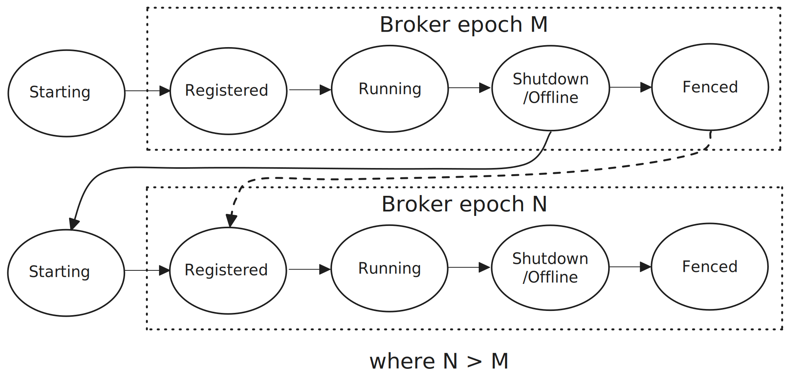
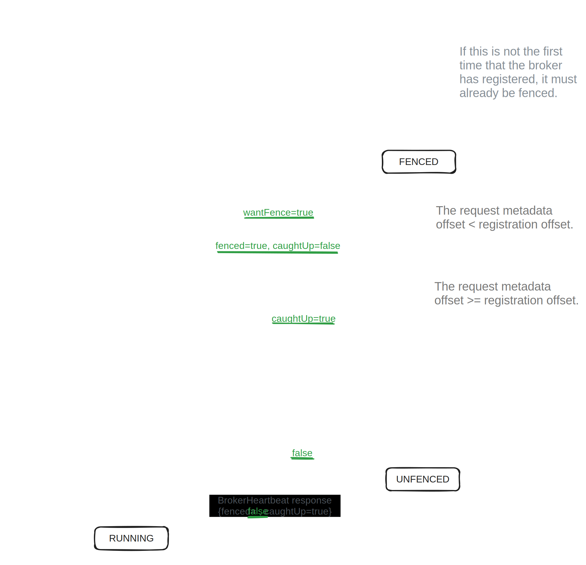

# 8. Broker lifecycle

So far broker restarts, fencing and broker epochs have been discussed but the full start-up and shutdown sequence has not been described. This section is not critical to understanding the protocol but does provide more detail that can help with a general understanding of Kafka.

## 8.1 The broker start-up sequence

A broker cannot simply start-up, activate any replicas it hosts and let the replication fly. There is a start-up sequence a broker goes through which starts with broker registration where the broker is assigned a monotonic broker epoch and is completed via piggy-backing information on broker heartbeat requests and responses.

The primary role of heartbeats is as a failure detection mechanism for the control plane. However, with the use of some additional fields in the heartbeat request and response, the controller and broker can communicate intent such as a controlled shutdowns, or status information such as whether a broker is fenced or not.

When a broker boots, it begins in the STARTING state. It sends a BrokerRegistration request to the controller with a unique randomly generated “incarnation id” which it stores in memory. The controller on receiving this BrokerRegistration will either accept it or reject it. It will accept the request if one of the following is true:
- The controller has no stored registration for this broker.
- The broker has a stored registration but this registration has expired (fenced due to lack of heartbeats).
- The broker has a non-expired registration which has an identical incarnation id. This is to ensure that a broker that is sending registration retries is able to complete registration. The incarnation id plays no further role in the broker lifecycle and no role at all in Kafka replication protocol.

When the controller accepts the BrokerRegistration request, it appends a BrokerRegistration record to the metadata Raft log and creates/updates in-memory state about the broker.

Key state maintained about a broker are:
- `broker epoch` (set to the offset of the registration record in the metadata log which is guaranteed to be unique and monotonic).
- `registration offset` (the offset of a broker’s registration record).
- `fenced` (true/false)
- `shuttingDown` (true/false)
- `shouldShutdown` (true/false)

As previously discussed, a new broker epoch can only be assigned when the broker has been fenced. The lifetime of a broker epoch is bounded by a final fencing plus a new registration (and new epoch).

<figure>
    
    <figcaption>Fig 1. A broker epoch lifetime.</figcaption>
</figure>
 

Upon receiving a successful response to its BrokerRegistration request, the broker switches to RECOVERY which is a local broker process where the broker’s storage layer takes stock of its current condition. This process is not related to the replication protocol - it is purely for internal housekeeping. Meanwhile, two other things occur. It starts the pull-based metadata log replication process where it fetches committed metadata update records from the controller. Secondly, it starts to send periodic heartbeats to the controller.

Each heartbeat includes a field `wantFence` which indicates whether the broker wants to be fenced or not. At first, the broker wants to be fenced but once the storage layer has completed its start-up and the broker has caught-up to its own BrokerRegistration record in the metadata log, it sets the `wantFence` field to false in its heartbeats. On receiving a heartbeat request with `wantFence=false`, the controller unfences the broker (checking again that its metadataOffset has reached its broker registration offset). It lets the broker know it is unfenced via the field `isFenced=false` in the heartbeat response.

The reason why a broker waits until it has caught up to its own BrokerRegistration record in the metadata log is so that it doesn’t start trying to replicate data based on a very stale copy of the cluster metadata. Waiting until it reaches its own registration record makes sure it is very close to the controller’s view of the cluster. Note that this is just an optimization and not required for correctness. The fetch mechanism uses various epochs to prevent stale replicas from causing issues.

The broker now switches to the RUNNING state and all its partition replicas assume their role as either leader or follower based on the currently known cluster metadata. This metadata can be slightly stale but the various epochs prevent a stale replica from making progress.

<figure>
    
    <figcaption>Fig 2. The broker start-up sequence.</figcaption>
</figure>

## 8.2 Steady state

A broker will remain in the RUNNING state until it shuts down or is abruptly terminated. While in the RUNNING state, the controller can fence and unfence the broker based on heartbeats and lack of heartbeats. As long as the broker is still running, eventually it will send a heartbeat to the controller and the controller will unfence it. Unfencing does not increment the broker epoch (that only occurs during broker registration when a broker starts up).

## 8.3 The controlled shutdown sequence

When a broker has been told to shutdown, it switches to the PENDING_CONTROLLED_SHUTDOWN state and communicates its intent to the controller via a heartbeat with `wantShutdown=true` set in its heartbeat. On receiving this request the controller records this intent in the broker registration and checks if the broker is a leader of any partitions. If the broker hosts any leader replicas then the controller places the broker in the `CONTROLLED_SHUTDOWN{fenced=false, shouldShutdown=false}` state and it records the current end offset of the metadata log as the controlledShutdownOffset. If the broker has no leader replicas it places the broker in the `SHUTDOWN_NOW{fenced=true, shouldShutdown=true}` state which will allow the broker to immediately shutdown.

The controller only allows the broker to switch from CONTROLLED_SHUTDOWN to SHUTDOWN_NOW once two things happen:

- The broker hosts no leader replicas.
- All other brokers which are unfenced and not shutting down have reached the `controlledShutdownOffset` and therefore have received the metadata updates related to the unloading of partition leadership of the shutting down broker.

Heartbeats continue until the broker receives a response with `shouldShutdown=true`.

The controlled shutdown sequence exists to ensure that all affected partitions have continued availability by ensuring that other live brokers have taken over leadership before the broker shuts down.

 
 

- [Back - 7. Configuring for availability over consistency](7_availability.md)
- [Next - 9. Formal verification](9_formal_verification.md)