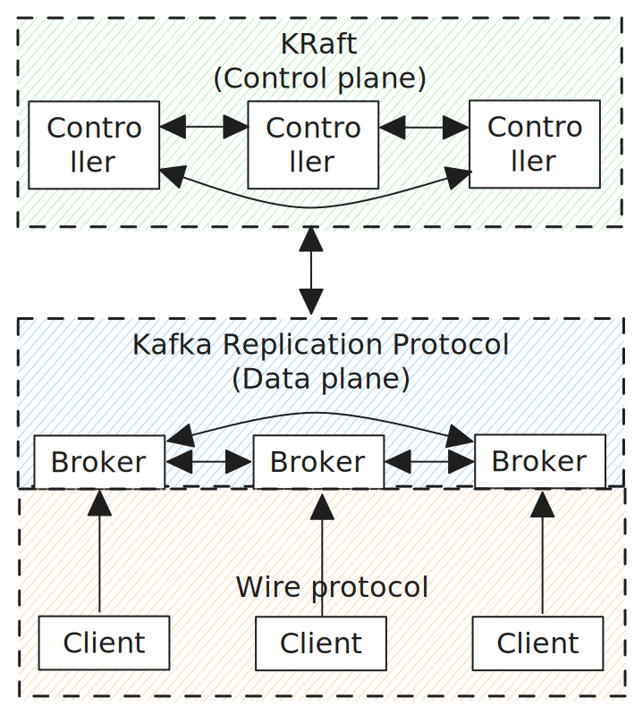

# 1. Introduction

Apache Kafka is a distributed log system which provides a streaming API for durable, partitioned and replicated logs. In this API, streams are exposed as topics which are themselves sharded into one or more partitions where each partition is an ordered, replicated log of immutable entries.

Each topic partition uses the Kafka replication protocol for its replication and high availability
logic. The core protocol focuses on log replication, but can be extended to be a [State Machine Replication protocol](https://en.wikipedia.org/wiki/State_machine_replication) (with peers such as Raft and Multi-Paxos). The protocol is specific to Kafka and not a general purpose SMR protocol that has many implementations in the wild. 

Kafka itself has many components implemented as replicated state machines (RSMs) built on top of the replication protocol. Kafka uses a Kafka-built-on-Kafka approach for many of its distributed components that require fault tolerance and high availability.

Examples of partition backed RSMs in a Kafka cluster:

- Transaction coordinators.
- Consumer group offset management.

Within Apache Kafka, the replication protocol should not be confused with either the Kafka wire protocol that the clients speak or KRaft which is a Raft-backed cluster control plane.

<figure>
    
    <figcaption>Fig 1. The Kafka protocols.</figcaption>
</figure>

While a single topic may be composed of multiple partitions, the unit of replication is the partition. A single partition can be considered a "cluster" of nodes where a node is called a "replica". Replicas are hosted on brokers but one broker can only host one replica of any given partition.

<figure>
    
    <figcaption>Fig 2. A topic composed of 2 partitions spread over 3 brokers.</figcaption>
</figure>

The replication protocol works at the partition level and is responsible for:

- Replicating partition data between replicas.
- Maintaining partition replica leadership (the protocol is a leader-follower design).
- Providing linearizable semantics to clients.

## 1.1 KRaft not Apache ZooKeeper

This protocol description describes how the KRaft-based Kafka replication protocol works. The ZooKeeper version is slightly different and is not covered.

We should first disambiguate KRaft from the Kafka replication protocol.

Kafka has a very important sub-system, called the controller, which can be thought of as the cluster control plane. When you create a topic, delete a user, modify some configuration etc, that is executed by the controller. The old controller was backed by Apache ZooKeeper whereas the new controller is built on KRaft - Raft-based replicated state machine.

Where KRaft is the control plane, the Kafka replication protocol is the performance optimized data plane. Topic partitions speak the Kafka replication protocol to consistently replicate their data. It is not Raft based but does interact with the KRaft controller - ultimately the Kafka replication protocol is a collaboration between the controller and the partition replicas.

<figure>
    
    <figcaption>Fig 3. KRaft and the Kafka replication protocol insersect at the controller.</figcaption>
</figure>

 
 

- [Back](0_kafka_replication_protocol.md)
- [Next - 2. The replication algorithm](2_replication_algorithm.md)