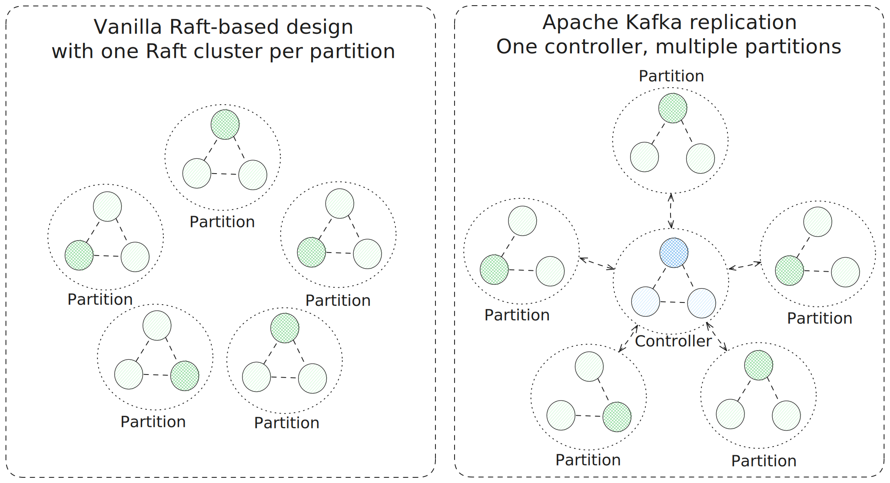
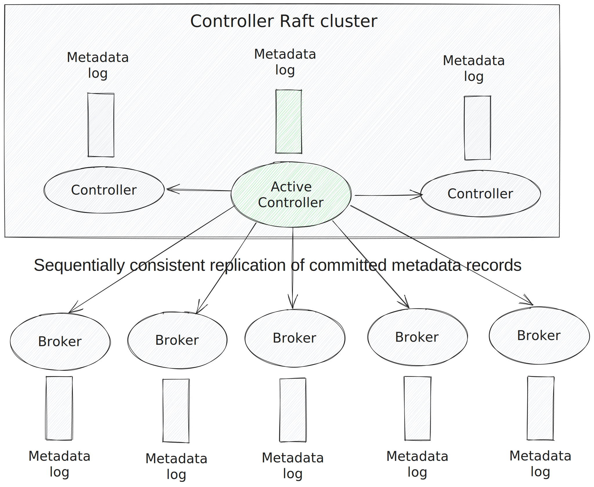
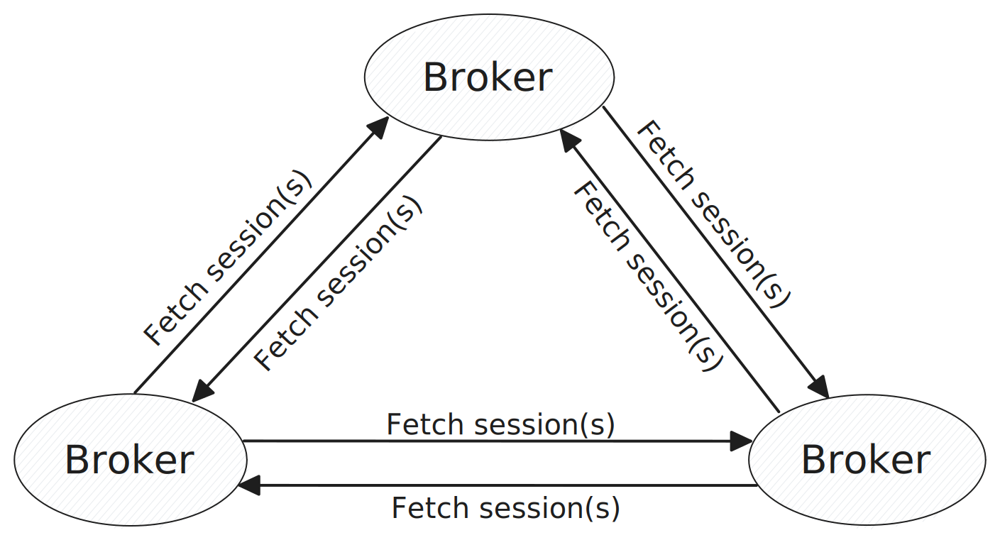
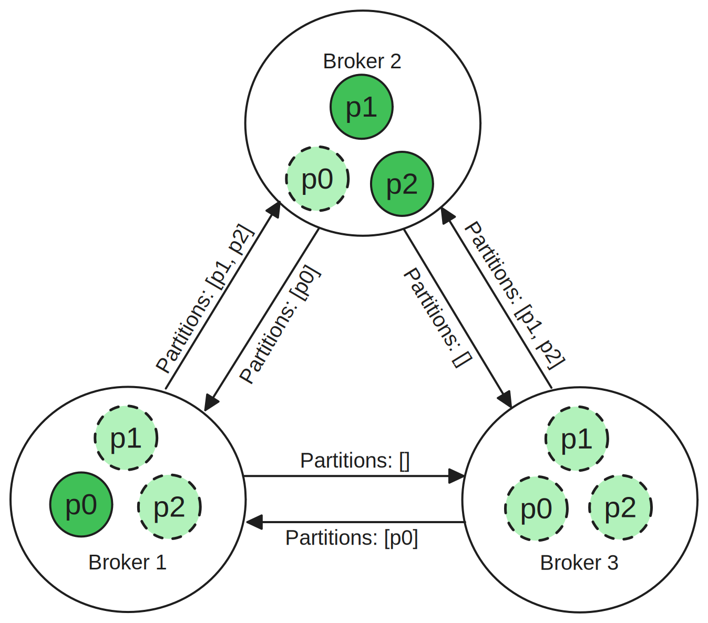
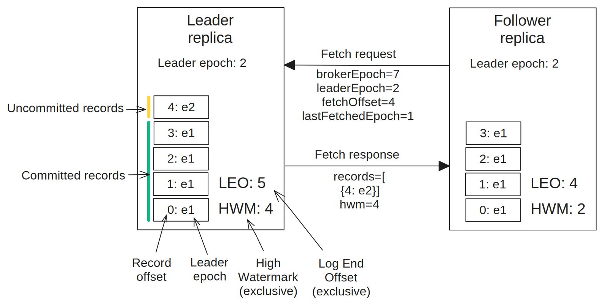
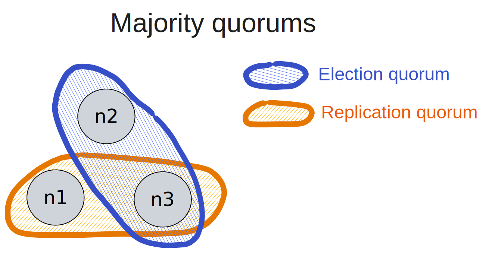
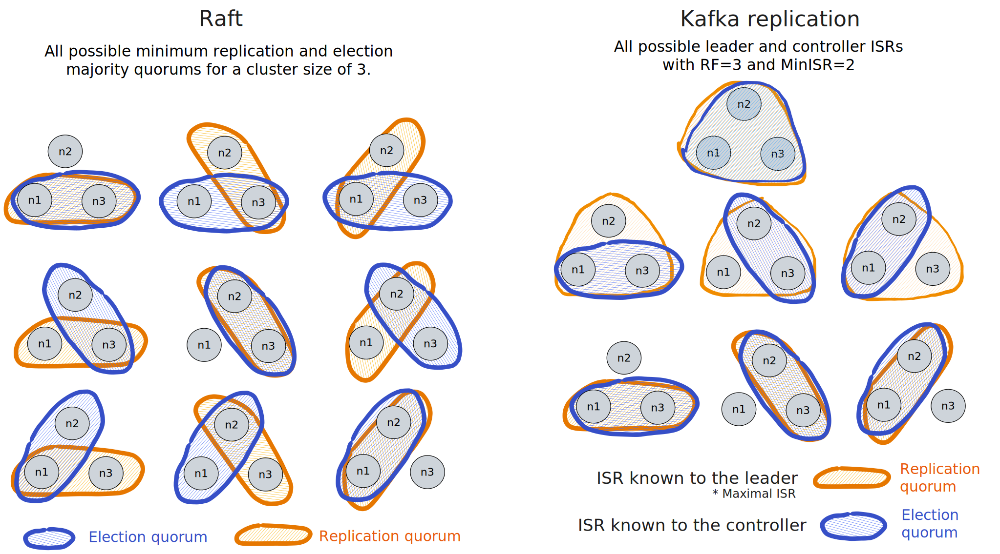
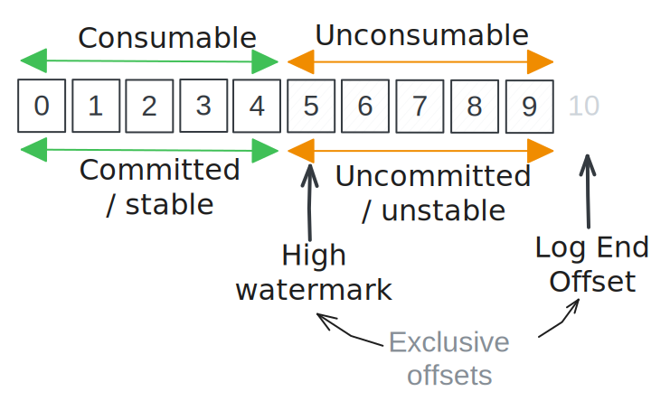

# 2. The replication algorithm

The replication algorithm is leader-based like other protocols such as Raft and Multi-Paxos. Unlike those protocols, Kafka replication is pull-based and the various functions of failure detection, leader election and replication are distributed across two node types: partition replicas and the controller.

<figure>
    
    <figcaption>Fig 1. Comparing a design based on one Raft cluster per partition to a Kafka cluster where each partition forms its own replication unit but communicates with a shared controller.</figcaption>
</figure>

## 1.2 Controllers, brokers and partitions

### 1.2.1 Metadata log replication

The controller is the cluster control-plane responsible for managing the cluster state, storing metadata and disemminating that metadata to brokers. It is a replicated state machine based on Raft and will have at least three nodes where one is the leader - known as the active controller.

With KRaft-mode, a Kafka cluster can be deployed with controllers and brokers as separate processes, or with the two combined in each node. This description will simply describe the logical topology with controllers and brokers as separate entities.

All cluster operations are performed on the active controller and usually involve a change to some metadata. Metadata can relate to users, permissions, configuration and partitions (among others). The controller has many sub-components for heartbeat handling, cluster changes and changes to partition metadata. All cluster metadata changes are first written to the controller Raft log and once committed are executed, changing the in-memory state of the controller. The metadata log is itself replicated to each broker with sequential consistency - that is to say that there is a total order (that matches the controller log) but each broker could be lagging behind the controller by some arbitrary amount. This metadata log copy is persistent and so data does not need to be re-fetched after a shutdown or crash. Each broker learns of the state of the cluster by receiving metadata updates in the log.

<figure>
    
    <figcaption>Fig 2. The metadata log and the controller and broker nodes.</figcaption>
</figure>

Brokers and the replicas they host learn of changes via this metadata replication from controller to broker. The specifics of the metadata are covered in each relevant section.

## 1.2.2 Broker epochs and fencing basics

Broker epochs and broker fencing are fundamental concepts referred to in many parts of the replication algorithm and so are covered here briefly. These two concepts are covered in greater detail in later subsections.

A *broker epoch* denotes one uptime session of a broker. Each time a broker starts up it receives a broker epoch from the controller. This epoch is a cluster-wide monotonic integer. Unlike with the ZooKeeper based-controller, there is no [ABA](https://en.wikipedia.org/wiki/ABA_problem) problem where a broker can be online, then offline but unobserved and then online again without the controller realizing. With KRaft, the broker registration process, which is carried out during broker start-up, involves the broker being assigned a monotonic broker epoch. This registration is added to the Raft metadata log which means this information survives controller fail-overs. The broker epoch plays a role in partition replication as an additional correctness barrier.

Brokers start in a fenced state and become unfenced once registered and having caught-up with the latest cluster metadata. Brokers send periodic heartbeats to the controller as a failure detection mechanism. Once the controller hasn’t received a heartbeat from a broker for a specific time period, the controller fences the broker. A fenced broker loses any partition leadership it had and its partition replicas cannot be elected as leader either as long as the broker remains fenced. Once fenced, a broker can be unfenced by sending a heartbeat or registering again after having shutdown, rebooted or crashed. When a broker is unfenced via a heartbeat its broker epoch remains unchanged - the broker epoch denotes an uptime session.

The complete broker lifecycle from start-up, to steady-state, to shutdown is covered in the [Broker Lifecycle](8_broker_lifecycle.md) section.

## 2.2 Polling-based replication

Kafka data-plane replication (partition data) is pull-based where leader replicas responds to fetch requests from followers. 

### 2.2.1 Fetchers and fetch sessions

Each broker can be configured with one or more fetchers. Each broker-broker pair maintains a set of fetch sessions in each direction (based on the configured number of fetchers). Each fetcher is given responsibility for a subset of the partitions hosted on that broker.

<figure>
    
    <figcaption>Fig 3. Each broker-broker pair maintains a number of fetch sessions in each direction. Each fetch request can include multiple partitions at a time.</figcaption>
</figure>
 
Each session has a fetcher object on the source broker which fetches for all its partitions where the source broker hosts a follower and the destination broker hosts the leader.

For example, given three brokers [b1, b2, b3] with one fetcher, and three partitions [p0, p1, p2]:

- p0 -> Leader: b1, Followers: [b2, b3]
- p1 -> Leader: b2, Followers: [b1, b3]
- p2 -> Leader: b2, Followers: [b1, b3]

The following fetch sessions are maintained:

<figure>
    
    <figcaption>Fig 4. The partitions of each fetch session.</figcaption>
</figure>
 

This means that physically speaking, polling is broker-to-broker not replica-to-replica but logically it is ok to think of fetch requests at the partition level for simplicity. When fetch requests are discussed in subsequent sections, know that fetch requests are broker-broker pair scoped and can contain the fetch state of multiple partitions in each fetch request.

Learn more about the underlying broker-to-broker fetch mechanism via [KIP-227](https://cwiki.apache.org/confluence/display/KAFKA/KIP-227%3A+Introduce+Incremental+FetchRequests+to+Increase+Partition+Scalability).

### 2.2.2 Partition replication

*Note: Offsets start at 0.*

Each replica stores the partition log itself as well as some additional fields:

- **Log End Offset (LEO)** which indicates the next offset of the log (or you can think of it as the exclusive end offset of the log). An empty log has an LEO of 0 as it is the next offset to be written.
- **High Watermark (HWM)** which marks the (exclusive) end of the committed log prefix. Like the LEO it is also exclusive so a value of 10 indicates that the log prefix 0-9 is considered committed and therefore stable. An empty log has a HWM of 0.
- **Log Start Offset** which indicates the lowest offset of the log. Limited data retention causes log garbage collection and this offset indicates the lowest offset that is still valid.
- **Last Stable Offset (LSO)** which denotes the (exclusive) end of the consumable log prefix and is related to Kafka’s transaction system. This protocol description does not yet include transactions and is therefore focused on the HWM (when we omit transactions the LSO = HWM).

Each record (batch) has an associated offset and the leader epoch at the time it was written to the leader’s log.

Partition records are replicated from the leader replica via fetch requests sent from each follower to the leader[1](#footnotes). The follower indicates its position in the log via the **fetch offset** which is set to its LEO.

Other key fetch request fields are:

- The **broker epoch**, a cluster-wide monotonic integer that denotes one broker uptime session. Each time a broker restarts it gets a new broker epoch from the controller. Replicas hosted on a given broker use its broker epoch and sometimes this is referred to as the replica epoch. Leaders learn of broker epoch changes of followers via fetch requests (and not via metadata updates).
- The **current leader epoch** of the partition (that the follower knows of, meaning it could be stale). A leader epoch denotes one leader term and partition assignment.
- The **last fetch leader epoch** which is the leader epoch of the last fetched record (required to detect log divergence).

If the request is valid the leader responds with a set of records starting from the fetch offset (if it has any).

<figure>
    
    <figcaption>Fig 5. The partition state on each replica and a single fetch request/response cycle.</figcaption>
</figure>
 

On the leader side, it stores state on each follower replica, including its LEO (known from the fetch offset of the last fetch request) and the broker epoch (also known from the last fetch request). The leader uses its knowledge of the LEO of its followers to advance the high watermark. The high watermark can only be advanced by the leader but is propagated to followers in the fetch responses. For this reason the high watermark is usually somewhat stale on the followers.

### 2.2.3 Adding and removing partitions to/from the fetchers

When a replica becomes a follower in a new leader epoch, it gets removed from the fetcher for the previous leader and added to the fetcher of the new leader, with a fetch offset equal to its LEO.

When a replica becomes a leader or gets removed from the replica set, the partition gets removed from its current fetcher (if added).

## 2.3 Partition metadata

Each partition has certain metadata stored by the controller which is also shared with the partition replicas.

- **Replicas**: the members of the partition (the broker ids).
- **Leader**: the replica that is the current leader or NoLeader.
- **ISR (The In-Sync-Replicas)**: The members which are currently “in-sync”, more on that next.
- **Leader epoch**: A monotonic integer. A leader epoch denotes a single leadership term and is incremented on each leader change and completed reassignment.
- **Partition epoch**: A monotonic integer. Each time the partition metadata is modified the partition epoch is incremented. This protects against concurrent or stale updates.
- **Adding**: A set of replicas that are in the process of being added as part of a reassignment.
- **Removing**: A set of replicas that are in the process of being removed as part of a reassignment.

The partition metadata does not include any information about offsets such as the HWM or LEO.

Note that the controller also stores the current broker epoch of each broker which also plays a role in partition metadata management. However, because this is broker-specific it is not stored in the partition metadata.

### 2.3.1 The leader epoch

Each election is assigned a monotonic leader epoch which is unique to that leader's term of office. Additionally, reassignments (where the replicas that form the partition replica set is changed) also increment the leader epoch and so a single leadership term can span multiple epochs. Therefore one leader epoch is unique to one partition assignment of a given election term.

### 2.3.2 Metadata update deltas and materialization 

Each change to the metadata of a partition is replicated as a separate change record delta. These deltas are replicated to each broker and then applied to the partition replicas in order to produce as full materialized metadata snapshots. Because deltas are replicated in batches, quick succession metadata changes can result in multiple deltas for the same partition being returned in the same batch. These deltas are merged in order with the current metadata to produce a new materialized snapshot of that partition's metadata and this is then acted on by the replica logic.

The protocol rules as described act on materialized metadata, not the deltas and some of the rules are necessary because the replicas are unable to see all intermediate states. For example, if a replica is quickly removed then readded to the partition replica set, then the replica logic may not see any change in the partition metadata (except if it were previously in the ISR but now is not).

## 2.3 The In-Sync-Replicas (ISR)

The In-Sync-Replicas (ISR) is a subset of the partition replica set (note that subsets can equal the set). ISR membership is curated by both the controller and leader replica. The ISR lies at the heart of the replication protocol and this subsection discusses its place in the protocol and how it relates to similar concepts in other protocols such as Raft.

While the Kafka replication protocol is unique in many ways in the field of leader-follower replication algorithms, it shares the fundamental properties of:

- Leader Completeness
- Log Matching

Leader Completeness is the property that the leader hosts the complete committed log. Log Matching is the property that the stable prefix of the log is consistent across all replicas. These property names are commonly known from the Raft paper but are general properties for most, if not all, leader-based SMR protocols.

> Leader Completeness property: The leader hosts the complete committed log. More concretely, the leader log contains all offsets up to the True HWM.

> Log Matching property: The stable prefix of the log is identical on all replicas. More concretely, for all leader-follower pairs, the log prefix on both replicas is identical where the prefix is bounded by the min(Leader Local HWM, Follower Local HWM).

If a replica hosts the complete committed log, we'll refer to that as a **complete replica**. Likewise, an incomplete replica does not host the complete committed log.

### 2.4.1 Quorums

A common principle behind how these systems provide consistency under bounded failure scenarios is overlapping quorums. Systems prefer quorums rather than requiring all nodes to perform a given action as not all nodes will always be available. A quorum is basically some minimum subset of the nodes that must participate in an action for it to complete successfully and often they are majority based though this is not the case with Kafka.

All these leader-based systems have two types of quorum: a replication quorum and an election quorum.

In a majority quorum system such as Raft, we can define the quorums as:

- A replication quorum is some minimum subset of nodes that must receive a write for it to get committed.
- An election quorum is some minimum subset of nodes that have must all vote for the same node in the same election term for the election to complete successfully.

In majority-based systems such as Raft, the replication and election quorums are a majority quorums. If the Raft cluster has 3 nodes, then the first two nodes that confirm a write constitute the minimum majority quorum required to commit the entry. A Raft election quorum is the group of nodes that have voted for the same node in the same term and collectively form a majority.

<figure>
    
    <figcaption>Fig 6. A Raft minimum replication quorum is guaranteed to overlap with a minimum election quorum.</figcaption>
</figure>
 

Raft guarantees election and replication quorum overlap because quorums are majorities. For example, if the last committed entry exists on a majority quorum of [n1, n2] then any election quorum is guaranteed to intersect with [n1, n2]. For example, each of the possible majority quorums contains either n1 or n2: [n1, n2], [n2, n3], [n1, n3]. Raft chooses the node with the highest term and offset of the election quorum which means it always chooses a node with the complete committed log.

Quorums in Kafka are slightly different as they are actually explicit curated sub-groups which have concrete members at any one time. Whereas Raft quorums are implicit in how data is replicated and votes are cast, Kafka quorums are curated groups stored in metadata.

Therefore we can define the quorums in Kafkas as:

- A replication quorum is a concrete subset of nodes that must all confirm a write for it to get committed.
- An election quorum is a leader candidate pool where any member can be selected as the next leader.

The replication and election quorums are recorded in metadata and metadata can be modified by both the controller and the replica leader. The protocol is exercised by both the controller and the partition replicas and changes to this metadata must be disemminated. 

The concrete sub-groups that form the replication and election quorums are:

- Replication quorum: The ISR known to the leader replica.
- Election quorum: The ISR known to the controller.

In Kafka, elections are performed by the controller which simply selects any replica that is a member of the ISR. In order to guarantee that the controller selects a replica with the complete committed log as leader, Kafka must guarantee that all replicas in the election quorum also exist in the replication quorum. 

For example, if the leader-known-ISR is composed of [r1, r2] that means a record is only committed when it has been written to both r1 and r2. If a leader election were to occur at this moment, either r1 or r2 could be selected safely as all acknowledged messages MUST be hosted on both. As long as the controller-known-ISR consists of r1 and r2, everything lines up. This can be distilled into the following property:

> Leader Candidate Completeness: All replicas in the controller ISR host the complete committed log. More concretely, all such replicas contain all offsets up to the True HWM.

Violation of Leader Candidate Completeness can lead to violation of Leader Completeness after an election (resulting in data loss). Given that there are no guarantees that the controller and replicas have the same knowledge of the ISR, extra safeguards are required to ensure this property holds. Additionally, there is some nuance to this property due to Kafka supporting asynchronous log writing which can result in local data loss on a replica. Therefore it is possible for a leader candidate to experience local data loss. However, this is detected and handled by the controller which removes such a replica from its candidate or leader status before a local data loss situation can propagate further.

> Note! There is one issue in this version of the protocol known as the [Last Replica Standing issue](5_recovery.md#53-the-last-replica-standing-issue) which violates Leader Completeness when the last replica in the ISR experiences an unclean shutdown (such as abrupt power loss or OS crash). This is addressed [KIP-966](https://cwiki.apache.org/confluence/display/KAFKA/KIP-966%3A+Eligible+Leader+Replicas).

The properties mentioned in this subsection are discussed further in sections [Asynchronous storage and recovery](5_recovery.md) and [Replication correctness](6_replication_correctness.md). 

<figure>
    
    <figcaption>Fig 7. Raft quorums vs Kafka quorums. Note that Raft just needs an overlap of at least one node whereas Kafka requires that the election quorum overlap such that it is a subset of the replication quorum.</figcaption>
</figure>
 

Note that the leader ISR shown in the above figure refers to the leader's Maximal ISR (see [The Maximal ISR](6_replication_correctness.md#652-the-maximal-isr)).

### 2.4.2 Safety and liveness guarantees

Majority quorum systems provide safety and liveness guarantees based on the number of nodes, where the size is determined by the formula: `Cluster size = 2f + 1`. Here `f` is the threshold of node failures we want the system to tolerate.

However, Kafka is not majority-quorum based and so does not use this formula. Instead safety guarantees are based on a tunable configuration called `min.insync.replicas` which we'll refer to as the **MinISR**.

The safety and liveness formula for Kafka is: `MinISR = f + 1` or alternatively, `f = MinISR - 1`. 

Clusters can be sized more freely with the number of replicas (Replication Factor or RF) and the MinISR being somewhat decoupled.

For example, with RF=5, an administrator could:

- choose a simple majority of MinISR=3 which balances safety and availability.
- go for higher durability with MinISR=4.
- go for higher availability with MinISR=2.

Also, unlike Raft, safety and liveness guarantees are slightly different. While the Min ISR applies to acknowledged writes it does not apply to consumer visibility. As is discussed later on, the high watermark can advance when the ISR has shrunk down to the leader regardless of the Min ISR. This difference between write acknowledgement and consumer visibility may exist historically to allow acks=1 requests to be consumable when only the leader is functioning. While this benefits availability, it means that the high watermark can go backwards under a particular single broker failure - see the [Last Replica Standing](5_recovery.md#53-the-last-replica-standing-issue) issue. This will be rectified in [KIP-966](https://cwiki.apache.org/confluence/display/KAFKA/KIP-966%3A+Eligible+Leader+Replicas).

## 2.5 Produce request durability level (acks)

Producers can indicate the level of durability via the producer config `acks`.

This config has three levels:

- `-1` or `all` tells the leader replica that it can only send a positive acknowledgment to the producer when all replicas in the ISR have confirmed they have written the request records.
- `1` tells the leader it can send a positive acknowledgement as soon as it has written the request records to local storage.
- `0` is basically fire-and-forget.

The `acks` producer config only pertains to when the leader acknowledges a produce request - it does not affect replication itself. As far as replication and the HWM is concerned, it's all about the records written to the leader log and all records on disk are treated equally.

The main focus of this protocol description is `acks=all` however, where relevant, `acks=1` will also be discussed.

## 2.6 min.insync.replicas (Min ISR)

When a producer sends a produce request with acks=all, it is logical to expect that the records will be stored redundantly by the time a positive acknowledgement is received. However, if the ISR has shrunk down to the leader, then an acknowledgment can be sent despite the records having only been written to the leader log.

To prevent this, the topic config `min.insync.replicas` exists, referred to from now on as the Min ISR.

The Min ISR does not place a lower-bound size on the ISR itself but instead rejects `acks=all` writes when the *ISR < Min ISR*.

When the ISR size shrinks below Min ISR, two things happen:

- All new `acks=all` produce requests are immediately negatively acknowledged (with the `NotEnoughReplicas` error) until the ISR expands to >= Min ISR again.
- Any pending uncommitted `acks=all` requests already written to the log are negatively acknowledged with the error `NotEnouhReplicasAfterAppend`.

This fail-fast mechanism helps slow replicas catch-up quickly as the leader log stops advancing. On the producer side, if the producer is using idempotency, it will simply retry on these errors and the broker will avoid duplicates from being added to the partition log. Therefore from the application side, the code does not need to handle these errors explicitly.

*Note, producer idempotency is currently out-of-scope in this protocol description.*

## 2.7 The high watermark (HWM)

The high watermark marks the end of the committed and stable log prefix from the uncommitted and unstable log suffix.

When transactions are not used the Last Stable Offset (LSO) and the High Watermark (HWM) point to the same offset. The LSO is generally omitted from this protocol description as transactions are not included (for now).

Only the stable portion of the log is visible to consumers.

<figure>
    
    <figcaption>Fig 8. The high watermark separates the committed/stable and consumer visible prefix from the uncommitted/unstable suffix.</figcaption>
</figure>
 

The leader advances the high watermark based on the current fetch offsets of its followers and the current Maximal ISR. The Maximal ISR is a variant of the ISR stored by the leader replica only. It is necessary when the leader performs ISR changes. The Maximal ISR is essentially the union of the current ISR and a proposed new ISR that has not yet been committed. See [The Maximal ISR](6_replication_correctness.md#652-the-maximal-isr) in the Replication Correctness section for more details.

The leader maintains state on each follower, including its broker epoch (sometimes referred to as the replica epoch), the leader epoch and its fetch offset. The HWM can advance when all followers in the Maximal ISR have a fetch offset higher than the current HWM (plus some additional rules covered later). When the HWN advances, any pending produce requests with records lower than the new HWM can be positively acknowledged.

The HWM advancement can be triggered on:

- A change to the known fetch offsets of the followers (when a fetch request is received).
- When the ISR shrinks (as after shrinkage, all members of the ISR may have a high enough fetch offset for the HWM to advance).
- When the leader receives a produce request (if the leader is the sole member of the ISR).

Kafka provides linearizable semantics to clients which means consumers should be able to consume acknowledged records immediately after a write completes, in the same real-time order they were written. This same order should not change, for consumers that are tailing the log as well as consumers which consume the log much later. Therefore consumers are only allowed to read up to the HWM as reading from the unstable suffix of the log could result in reads which are not consistent with the acknowledged write history. HWM advancement triggers both the producer acknowledgement and consumer visibility of the records.

Note however that it is possible for records to be read by consumers that no producer received a positive acknowledgment for. These cases include:

- The producer, broker or network connection failed before the positive acknowledgement could be sent/received.
- An acks=all request gets written to the leader log but then before the records get committed the ISR size drops lower than MinISR which results in a negative acknowledgement sent to the producer. However, once written to the log, the request records will eventually get replicated (as long as a leader election doesn’t occur before that can happen). This means these records can get committed (despite having been negatively acknowledged) and read by consumers. This is where idempotent writes are important as when employed by producers, as soon as the ISR recovers to reach MinISR replicas, the producer will receive a positive acknowledgement for those records (without duplication).

## 2.8 Leader elections

Leadership needs to change according to the conditions and we’ll study how those changes are performed in this section. The leader and ISR is durably and consistently stored in the partition metadata by the KRaft controller.

Only the controller can elect leaders. A leader election occurs when any of the following occur:

- The current leader gets fenced.
- There is currently no leader but a replica becomes a leader candidate.

When a broker gets fenced due to the lack of a heartbeat or because it has shutdown, the controller performs the following (atomically) to each partition for which it hosted the leader replica:

- Remove the replica as leader.
- Remove the replica from the ISR.
- If there is at least one replica in the ISR (that is not shutting down), select one as the new leader, else set the leader as NoLeader.
- Increment the leader epoch.
- Increment the partition epoch.
- Commit the new partition metadata.

When a partition has no leader it means that the ISR has shrunk down to one replica (the leader) and that leader replica has also been fenced. The ISR cannot shrink to empty, once the last replica standing gets fenced, it remains in the ISR and so remains the only candidate for being elected leader in the future. The partition essentially remains unavailable until that last leader gets unfenced by the controller.

The partition replicas will learn of any change to the partition metadata via PartitionChange records in the metadata log that is replicated from the controller to the brokers.

## 2.9 Modifying the ISR

Both the controller and the partition leader can modify the ISR and because both act independently, the partition epoch is required to guarantee consistency.

The controller is able to shrink the ISR down to empty but is not allowed to expand it. It is the leader's job to expand the ISR as expansion is based on knowledge of the follower log and the controller knows nothing of this. The leader adds a follower to the ISR when the out-of-sync follower has become “in-sync”. 

Shrinking the ISR is a safe operation in of itself (though can lower redundancy). Shrinkage can be needed to maintain availability and bound latency. If a member of the ISR goes offline or falls behind, keeping it in the ISR does not affect consistency, but it can prevent or slow down the advancement of the HWM which affects producer acknowledgement and consumer visibility of records. For example, when the ISR=[r1,r2,r3] but r3 is offline, then it will block HWM advancement and a shrinkage down to [r1,r2] will enable the HWM to advance again.

Without extra controls, expanding the ISR would be a potentially unsafe operation as getting it wrong could violate the Leader Candidate Completeness property, leading to data loss. It is the leader that expands the ISR and it does so based on some rules. The rules for qualifying a follower as in-sync with the leader can be categorzied as those pertaining to latency/availability and those pertaining to consistency.

Latency/availability rules:

- The follower log is either not lagging behind the leader log, or is only lagging a very small amount.
- The leader has received a fetch request within a short time frame (10 seconds by default).

Consistency rules:

- The follower is already a member of the ISR.
- The follower is not currently a member of the ISR but:
  - The out-of-sync follower fetch offset has reached the HWM.
  - The out-of-sync follower fetch offset has reached the Leader Epoch Start Offset (LESO).
  - The leader has received a fetch request from the out-of-sync follower in the current leader epoch.

Shrinking the ISR is based on the latency/availability rules. Expanding the ISR is based on all rules.

There is further discussion of "in-sync" and high watermark advancement in [Replication Correctness](6_replication_correctness.md).

### 2.9.1 Controller initiated changes

As explained above, the controller can only shrink the ISR and only when a broker gets fenced or shutdown. In cases where the fenced broker hosts a follower replica which is in the ISR, no leader election occurs but the ISR change needs to be committed. For those partitions, the controller updates the ISR and increments the partition epoch.

Replicas learn of this change via the metadata log.

### 2.9.2 Leader initiated changes

A leader replica can both expand and shrink the ISR due to changes in conditions. The leader replica sends an AlterPartition request to the controller with the proposed ISR. The leader immediately updates its Maximal ISR to be the union of the current ISR and the new proposed ISR. Later it will commit or rollback the change depending on the response from the controller. HWM advancement is always based on the Maximal ISR.

The AlterPartition request contains the following key data:

- Broker epoch of the leader replica
- Current partition epoch
- Current leader epoch
- The leader replica
- The proposed ISR
- The broker epoch of any added replicas.

The controller will accept an AlterPartition request only when the following is true:

- The broker epoch of the leader is correct.
- The partition epoch matches the current metadata.
- The broker epoch of any added replicas is correct.

If the leader receives a success response it commits the change to its local metadata:

- Sets the ISR and maximal ISR to the accepted ISR.
- Updates the partition epoch.

If the leader receives an error response, it rolls back to the prior committed metadata (resetting the maximal ISR to the ISR).

Lastly the leader may advance the HWM if the updated maximal ISR change now allows the HWM to advance.

Note that it is possible for the leader to receive the metadata record for the partition change before receiving the AlterPartition response, therefore the local partition metadata should only be updated if the partition epoch of the update/response is higher than the currently known partition epoch.

## 2.10 Partition changes and replica transitions

Fetching is impacted by leader epoch changes in the following ways:

- Inflight fetch requests may get rejected due to the recipient no longer being the leader or because the leader epoch in the fetch request does not match the leader epoch of the recipient. The recipient may not be the leader because of an election or because it got removed from the replica set (both of which cause the leader epoch to increment). This mismtach can occur because the recipient learned of the leader epoch change first, or because the sender learned first. Only once both sides have learned of the change can fetching be successful.
- The local partition may need to either/and:
  - be removed from the current fetcher.
  - added to the fetcher of the new leader.

When a replica learns of a partition change, it is either instructed to be a leader or follower. This role can match its current role or could be a role change. The action taken by the replica depends on the type of role change and whether the leader epoch has changed.

Remember that due to metadata delta materialization, the role change could span multiple metadata changes which are hidden from the replica logic itself.

Many of the actions taken in these transitions are discussed in [Replication Correctness](6_replication_correctness.md).

### 2.10.1 Transition from follower to leader

- The partition is removed from its current fetcher.
- The replica ensures all follower state is cleared.
- The replica sets the Leader Epoch Start Offset (LESO).
- If the ISR is only the leader then the leader can advance the HWM to its LEO.

### 2.10.2 Transition from leader-to-leader in the same leader epoch

If the partition change is the result of an ISR shrink or ISR expansion, this could be the change required to allow the HWM to advance so the leader checks if it can advance the HWM.

### 2.10.3 Transition from leader-to-leader in a new leader epoch

The leader epoch change could be due to an election or a reassignment. If caused by an election, then between the leader's current knowledge of the partition metadata and the new update, it must have lost leadership and then been reelected. Remember that replicas react to materialized snapshots of potentially multiple partition change deltas compressed into one.

The leader must:

- Clear the last fetch time of out-of-sync followers. This ensures that these followers cannot be added to the ISR until a fetch is received in this leader epoch.
- The replica sets the Leader Epoch Start Offset (LESO).

### 2.10.4 Transition from leader-to-follower

The partition fetch state is added to the fetcher whose destination broker is the broker that hosts the new leader. The initial fetch state includes the fetch offset (the current LEO), the broker epoch and the new leader epoch.

### 2.10.5 Transition from follower-to-follower in the same leader epoch

The follower does not need to do anything as no leader change has occurred. ISR changes are immaterial to the follower.

### 2.10.6 Transition from follower-to-follower in a new leader epoch

The partition is removed from the current fetcher and added to the fetcher where the destination broker is the new leader (which may be the same leader as before). The initial fetch state includes the fetch offset (the current LEO), the broker epoch and the new leader epoch.

## Footnotes

1. Remember fetch requests are broker-to-broker requests which include multiple partitions, but for simplicity we’ll often talk about fetch requests with regard to a particular partition.

 
 

- [Back - 1. Introduction](1_introduction.md)
- [Next - 3. Log Divergence](3_log_divergence.md)