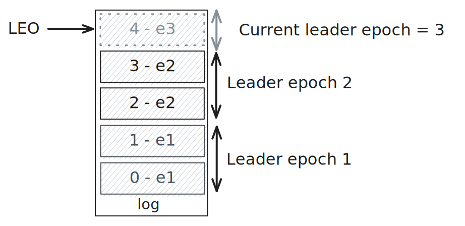
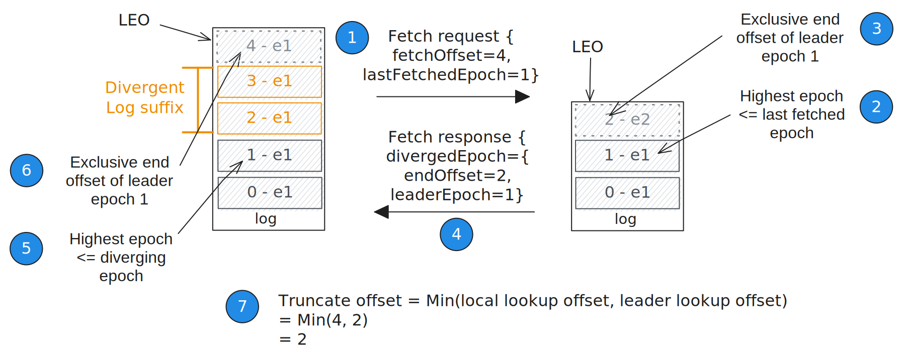
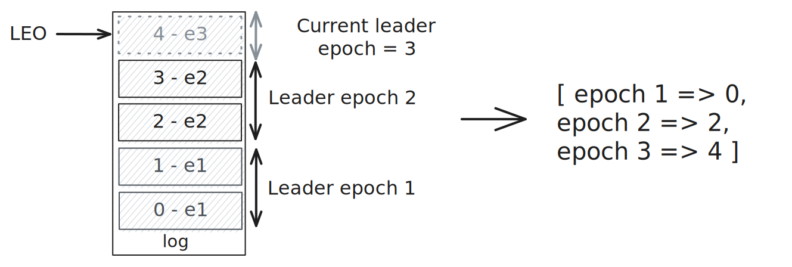
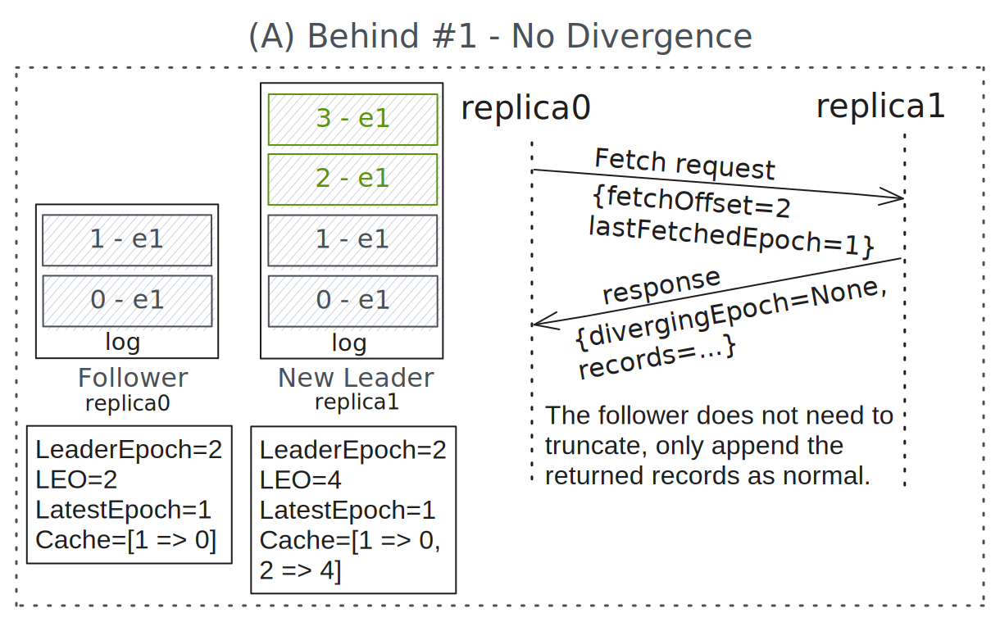
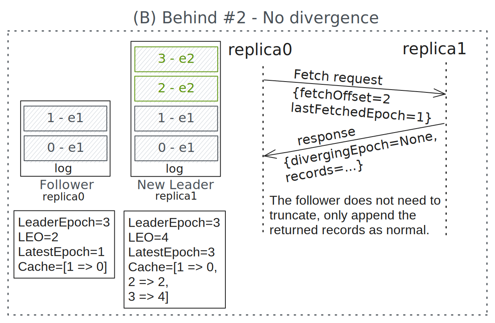
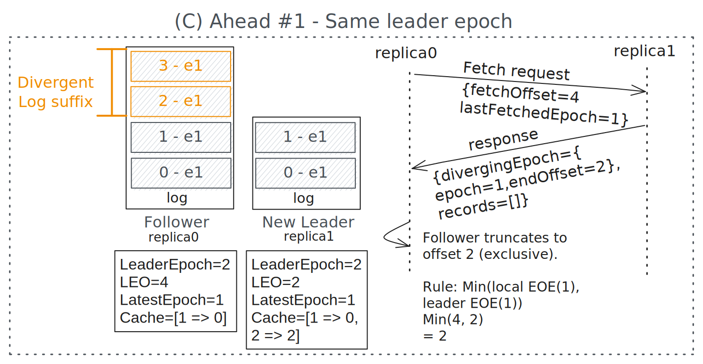
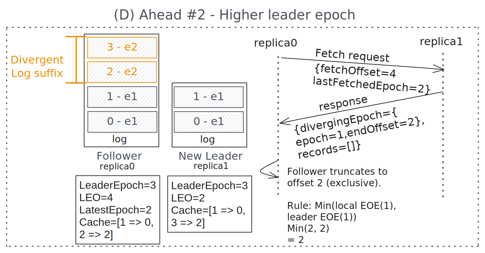
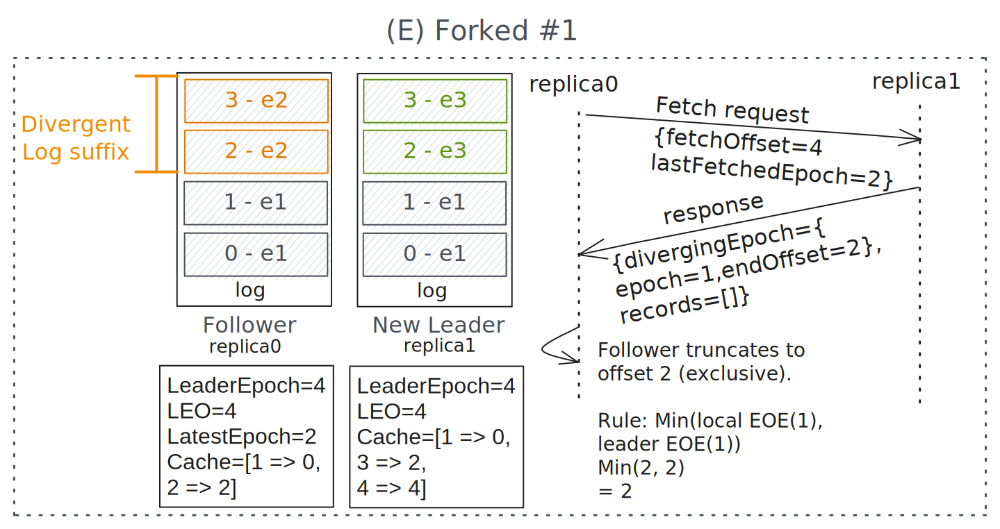
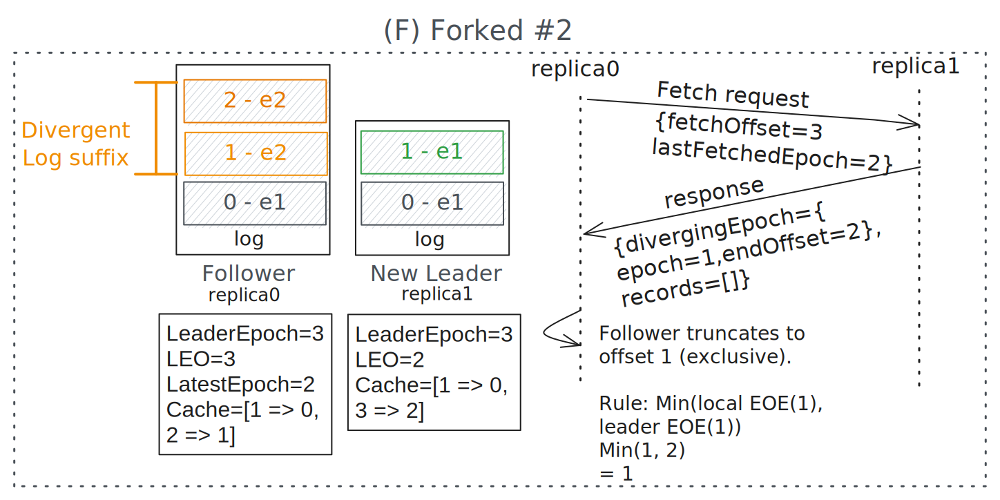
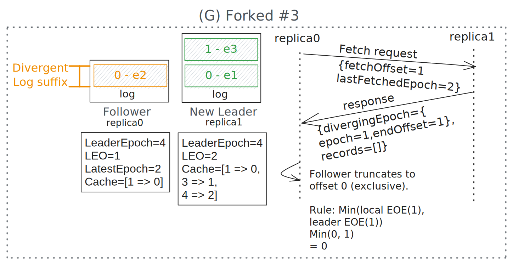

# 3. Detecting and avoiding log divergence

Distributed replicated log designs such as Raft, Apache Kafka and Apache BookKeeper share the common property that the stable portion of the log on each node must match each other. This is known as the Log Matching property. With Kafka this is expressed as the following:

> Log Matching property: For all leader-follower pairs, the log prefix on both replicas is identical where the prefix is bounded by the min(Leader Local HWM, Follower Local HWM).

The committed prefix of the replicated log must be consistent across all nodes. The committed portion of the log is considered stable and once stable any divergence will remain in place. Therefore log matching is enforced in the unstable suffix via log truncation on followers. When a leader is elected, it treats its entire log as the one-source-of-truth and all followers must ensure that their logs are consistent with the leader. Post-election, if a follower has some log divergence from the leader, it must truncate the divergent portion of its log before replication between the leader and follower can make progress. In this section we’ll discuss how logs can diverge and the truncation mechanism.

# 3.1 How logs can diverge

After a leader election, the log of the leader may have diverged from the logs of the followers.

Remember that offsets start at 0 and the LEO is the “last offset in the log + 1”, so when the log is empty the LEO=0 and the same applies to the HWM.

Here is an example of how a follower log diverges from the leader log after an election.

1. Partition state: `Replicas [r1, r2, r3], ISR=[r1, r2, r3], Leader=r1`.
    - Replica 1 (leader): `LEO=0, HWM=0, LeaderEpoch=1, Log=[]`
    - Replica 2: `LEO=0, HWM=0, LeaderEpoch=1, Log=[]`
    - Replica 3: `LEO=0, HWM=0, LeaderEpoch=1, Log=[]`
2. Leader receives a write with record A in leader epoch 1. Replicas r2 and r3 send a fetch request with a fetch offset of 0 and the leader sends a response with record A and a HWM of 0.
   - Replica 1: `LEO=1, HWM=0, LeaderEpoch=1, Log=[{data=A,le=1}]`
   - Replica 2: `LEO=1, HWM=0, LeaderEpoch=1, Log=[{data=A,le=1}]`
   - Replica 3: `LEO=1, HWM=0, LeaderEpoch=1, Log=[{data=A,le=1}]`
3. Replicas r2 and r3 send another fetch request with fetch offset 1. The leader knows both itself and replicas r2 and r3 have offset 0. This means that all replicas in the ISR have confirmed the write and so the leader advances the HWM. The leader also receives a write with record B in leader epoch 1.
   - Replica 1: `LEO=2, HWM=1, LeaderEpoch=1, Log=[{data=A,le=1},{data=B,le=1}]`
   - Replica 2: `LEO=1, HWM=0, LeaderEpoch=1, Log=[{data=A,le=1}]`
   - Replica 3: `LEO=1, HWM=0, LeaderEpoch=1, Log=[{data=A,le=1}]`
4. Before record B can be replicated to the followers, the controller fences replica 1 and elects replica 2 as the leader in leader epoch 2.
   - Replica 1: `LEO=2, HWM=2, LeaderEpoch=1, Log=[{data=A,le=1},{data=B,le=1}]`
   - Replica 2 (new leader): `LEO=1, HWM=0, LeaderEpoch=2, Log=[{data=A,le=1}]`
   - Replica 3: `LEO=1, HWM=0, LeaderEpoch=1, Log=[{data=A,le=1}]`
5. Replica 1 is then told to become a follower in leader epoch 2. The new leader, r2, now has a divergent log from follower replica 1 (it has fewer records than the follower). Replica 1 must remove offset 1 from its log else its log will continue to diverge from that of the leader.

## 3.2 The truncation mechanism

There have been at least two truncation mechanisms prior to the current truncate-on-fetch design though only the current approach is documented here.

Log divergence is detected by comparing the requested offset and the last leader epoch fetched against the state of the leader log. Each log record has an offset and a leader epoch (the leader epoch at the time it was written to the leader log).

<figure>
    
    <figcaption>Fig 1. The log has four records, with two written in leader epoch 1 and two written in leader epoch 2. No records have yet been written in the current leader epoch 3 so the start offset of epoch 3 is the LEO.</figcaption>
</figure>
 

Log divergence is detected by the leader when a follower sends its first fetch request after an election. The fetch request includes the fields `fetchOffset` which aligns with its LEO, and `lastFetchedEpoch` which is the leader epoch associated with its last log record.

Upon receiving the fetch request, the leader performs an *End Offset for Leader Epoch* lookup against a local cache which returns an epoch and offset such that:

- The epoch is the highest leader epoch in its log <= target epoch.
- The offset is the exclusive end offset of that leader epoch.

If there is no such leader epoch then the lookup returns:

- The requested (last fetched) epoch.
- The start offset of the lowest epoch in the log as this will act as the exclusive end offset to be truncated.

Either of the following results indicate a diverged log:

- The epoch of the End Offset for Leader Epoch lookup is less than the lastFetchedEpoch of the fetch request.
- The offset of the End Offset for Leader Epoch lookup is less than the fetchOffset of the fetch request.

When a diverged log is detected, the leader sets the field `divergedEpoch` in its fetch response, with the value of the lookup epoch and end offset.

The follower, on seeing the divergedEpoch field being non-null, performs its own End Offset for Leader Epoch lookup, using the epoch in the divergedEpoch field. It then takes the minimum of the offset of its own lookup and the offset in the divergedEpoch field. It then truncates its log to that offset (exclusive).

<figure>
    
    <figcaption>Fig 2. An example of the truncation mechanism at work.</figcaption>
</figure>
 

Each replica stores a Start Offset for Leader Epoch cache to perform these lookups rather than having to read the log itself.

<figure>
    
    <figcaption>Fig 3. A leader epoch start offset cache speeds up lookups.</figcaption>
</figure>
 

This can be difficult to reason about, so the following section goes through multiple possible types of divergence and how the truncation mechanism works.

## 3.3 Truncation with different divergence examples

The following examples show the immediate aftermath of a leader election where both leader and follower have learned of the new leader epoch. Both follower and leader have log records which were written in prior leader epochs. The examples show how the first fetch request and response result in either no truncation of the follower log (due to no divergence) or some truncation when divergence has occurred.

Each example shows the following replica state:

- Leader epoch. The current leader epoch the replicas know of.
- Latest epoch. This is the last leader epoch stored in the log itself.
- Cache. This is a map of Start Offset for Leader Epoch which can be built by reading the log. It is used to calculate the End Offset for Leader Epoch for the divergingEpoch field in the fetch response.

### 3.3.1 Case A (no divergence). Follower log behind the leader.

<figure>
    
    <figcaption>Fig 4.  The leader log has additional records of the same leader epoch which means there is no log divergence. The follower simply needs to append the returned records as normal.</figcaption>
</figure>

### 3.3.2 Case B (no divergence). Follower log behind the leader

<figure>
    
    <figcaption>Fig 5. The leader log has additional records with a higher leader epoch which means there is no log divergence. The follower simply needs to append the returned records as normal.</figcaption>
</figure>

### 3.3.3 Case C (divergence). Follower log ahead of the leader

<figure>
    
    <figcaption>Fig 6. The follower log is ahead of the new leader log, with extra records of leader epoch 1.</figcaption>
</figure>
 

While the lastFetchEpoch matches the latest epoch on the leader, it detects that the fetch offset is too high. Therefore it responds with a diverging epoch of {epoch=1, endOffset=2}.
The follower selects the minimum of:

- It’s local End Offset for Epoch (EOE) for leader epoch 1 = offset 4.
- The leader’s End Offset for Epoch for leader epoch 1 = offset 2

Therefore it selects truncation offset (exclusive) = 2.

### 3.3.4 Case D (divergence). Follower log ahead of the leader

<figure>
    
    <figcaption>Fig 7. The follower log is ahead of the new leader log, with extra records with a higher leader epoch.</figcaption>
</figure>

The lastFetchEpoch does not exist in the leaders Start Epoch for Leader Epoch cache. It returns a diverging epoch for the requested epoch (epoch 1) and the start offset of the next highest epoch (the current leader epoch which is 3) as the endOffset. The start offset of epoch 3 is the LEO.

The follower selects the minimum of:

- It’s local End Offset for Epoch (EOE) for leader epoch 1 = offset 2.
- The leader’s End Offset for Epoch for leader epoch 1 = offset 2

Truncation offset (exclusive) = 2.

### 3.3.5 Case E (divergence). Follower log forks from the leader log

<figure>
    
    <figcaption>Fig 8. The follower log forks from the new leader log.  Each fork has a different leader epoch.</figcaption>
</figure>
 

The lastFetchEpoch does not exist in the leaders Start Epoch for Leader Epoch cache. It returns a diverging epoch with the highest epoch <= requested epoch (which is epoch 1) and the end offset as the start offset of the next highest epoch (which is offset 2). 

The follower selects the minimum of:
- It’s local End Offset for Epoch (EOE) for leader epoch 1 = offset 2.
- The leader’s End Offset for Epoch for leader epoch 1 = offset 2

Truncation offset (exclusive) = 2.

### 3.3.6 Case F (divergence). Follower log forks from the leader log

<figure>
    
    <figcaption>Fig 9. The follower log forks from the new leader log.  The follower fork has a different leader epoch but the leader fork simply has extra records of epoch 1.</figcaption>
</figure>
 

The lastFetchEpoch does not exist in the leaders Start Epoch for Leader Epoch cache. It returns a diverging epoch with the highest epoch <= request epoch (epoch 1) and the end offset as the start offset of the next highest epoch which in this case is the current leader epoch (offset 2). 

The follower selects the minimum of:

- It’s local End Offset for Epoch (EOE) for leader epoch 1 = offset 1.
- The leader’s End Offset for Epoch for leader epoch 1 = offset 2

Truncation offset (exclusive) = 1.

### 3.3.7 Case G (divergence). Follower log forks from the leader log

<figure>
    
    <figcaption>Fig 10. The follower log forks from the new leader log.  The follower log and leader log have no common leader epochs at all.</figcaption>
</figure>
 

The lastFetchEpoch does not exist in the leaders Start Epoch for Leader Epoch cache. It returns a diverging epoch with the highest epoch <= requested epoch (epoch 1) and the end offset as the start offset of the next highest epoch (offset 2). 

The follower selects the minimum of:

- It’s local End Offset for Epoch (EOE) for leader epoch 1 = offset 0. The follower does not have an epoch 1 or any lower epoch so uses offset 0.
- The leader’s End Offset for Epoch for leader epoch 1 = offset 1

Truncation offset (exclusive) = 0. This completely truncates the log.

 
 

- [Back - 2. The replication algorithm](2_replication_algorithm.md)
- [Next - 4. Partition reassignment](4_reassignment.md)