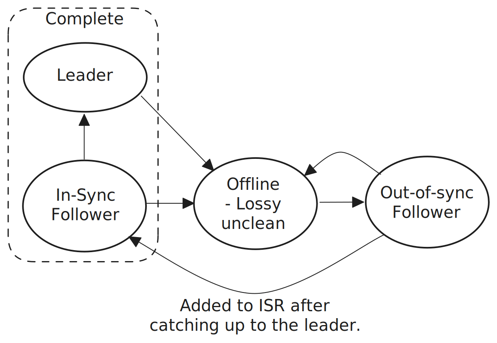

# 5. Asynchronous storage and recovery

Unlike protocols such as Raft and Paxos, the Kafka replication protocol is designed to support the asynchronous writing of log records to disk. This is attractive because disk flushes are expensive and even modern SSDs prefer large sequential writes than smaller random ones. By leveraging the page cache and the ability to perform fewer, larger writes to the underlying disk, Kafka gains a lot in sustained performance. However, the trade-off is that replicas can lose data that they previously acknowledged and without building special behavior into the protocol, local data loss can easily translate into global data loss.

Therefore Kafka employs recovery as a strategy to replace the stable storage guarantees it loses when not employing synchronous flushing. Other protocols such as [Viewstamped Replication Revisited](https://pmg.csail.mit.edu/papers/vr-revisited.pdf), Apache BookKeeper (without the journal) and the [SAUCR paper](https://www.usenix.org/system/files/osdi18-alagappan.pdf) have similar recovery mechanisms which allow them to write to disk asynchronously. However, because they are quorum based, the rules regarding leader eligibility are slightly different to Kafka.

Kafka can be configured with the following flush behavior:

- Every write (before HWM advancement and therefore writes are synchronous).
- Every nth write (allowing the HWM to advance in between flushes and therefore writes are asynchronous).
- Every n milliseconds (allowing the HWM to advance in between flushes and therefore writes are asynchronous).
- Only when a segment is rolled, split etc (asynchronous).

Note that the OS will be performing constant background flushes, keeping the dirty ratio below its configured threshold.

The rest of this section related to Kafka configured to write asynchronously to disk.

## 5.1 Recovery basics

### 5.1.1 Unclean shutdowns/abrupt terminations

Local data loss can occur when a broker experiences an unclean shutdown. We’ll define a general unclean shutdown as just case 1 below but a lossy unclean shutdown requires both case 1 and 2:

1. The shutdown is either abrupt and instantaneous or does not leave enough time for the full shutdown sequence to occur. 
2. The process page cache is also discarded.

A controlled shutdown sequence includes the flushing of all unflushed data to disk. If this disk synchronization process is not performed and the page cache is also discarded then data loss can occur. The page cache would not be discarded if the Kafka process was terminated but the OS remained up. This is one advantage that Kafka has over Viewstamped Replication Revisited and Apache BookKeeper (without the journal) as both of those designs keep unflushed data in process memory, not the page cache.

### 5.1.2 General approach

When a broker restarts, whether it is clean or unclean, before it can complete its boot sequence, the broker will already be fenced by the controller and have been removed from all partition leadership and all partition ISRs. To complete its boot sequence, is gets assigned a new monotonic broker epoch by the controller.

Once registered and in the RUNNING status, all a broker's partition replicas are out-of-sync followers and can only be readded to their respective ISRs when they have become in-sync. This gives us the Unclean Exclusion property.

> Unclean Exclusion property: A replica that has restarted after a lossy unclean shutdown must be excluded from leadership and the ISR until it has provably caught-up to the leader.

<figure>
    
    <figcaption>Fig 1. When a leader or in-sync follower experiences a lossy unclean shutdown, it must first pass through the out-of-sync phase where it is not a leader candidate. Only once it has proven itself to host the complete committed log can it become a leader candidate.</figcaption>
</figure>
 

Out-of-sync followers are those that have become unreachable, fallen behind or become untrustworthy due to an unclean shutdown. The only way of becoming trusted again is to prove trustworthy by catching up to the leader.

However, there is one scenario not covered by the recovery design of this Kafka version which violates the Unclean Exclusion property - the Last Replica Standing issue.

## 5.2 The Last Replica Standing issue

The ISR cannot shrink to empty because the design uses the ISR as the candidate pool for leader elections. When the controller has fenced replicas such that the ISR has shrunk to the last replica standing, the leader, and then this last replica also gets fenced the ISR does not shrink further but is frozen. At this point, the only candidate for leadership is the former leader as it is the only replica in the ISR. When it becomes available again, it gets unfenced and is made leader in a new leader epoch. As followers catch-up, the leader can expand the ISR.

However, in this last replica standing scenario, if the leader got fenced because of an unclean shutdown that resulted in the loss of committed records, then upon assuming leadership in the new leader epoch, any followers who hosted these locally lost committed records would truncate their logs turning a local data loss problem into a global one.

This issue is addressed in the Eligible Leader Replicas proposal ([KIP-966](https://cwiki.apache.org/confluence/display/KAFKA/KIP-966%3A+Eligible+Leader+Replicas)). Read the [full protocol description](../../kip-966/description/0_kafka_replication_protocol.md) with KIP-966 applied.

## 5.3 Deploying across failure-domains

Deploying distributed data systems across failure-domains enables the system to be reliable and available even under correlated failures such as a data center fire, a power surge that can damage hardware, a power outage or some other incident that affects multiples servers at a time. Random failures such as disk drive failures are common but do not commonly affect multiple servers of the same cluster at the same time.

Kafka replication over multiple brokers enables a Kafka cluster to tolerate random failures and replication over brokers spread across multiple failure domains enables a cluster to tolerate correlated failures that might otherwise cause an unclean shutdown on multiple brokers. This is a standard deployment model for distributed data systems and it the recommended approach for Kafka. In the cloud this means deploying brokers across multiple availability zones.

 
 

- [Back - 4. Partition reassignment](4_reassignment.md)
- [Next - 6. Replication correctness](6_replication_correctness.md)